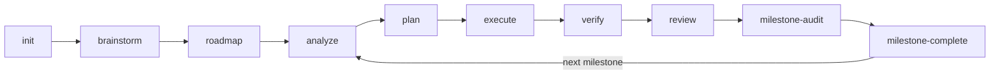

<div align="center">

# Maestro-Flow

### The Orchestration Layer for the Multi-Agent Era

**Don't just run agents. Orchestrate them.**

[](https://www.typescriptlang.org/)
[](https://nodejs.org/)
[](https://modelcontextprotocol.io/)
[](LICENSE)

[English](README.md) | [简体中文](README.zh-CN.md)

</div>

---

Maestro-Flow is a workflow orchestration framework for multi-agent development with Claude Code, Codex, Gemini, and other AI agents. It automates the most time-consuming part of AI-assisted engineering — deciding which agents to use, in what order, with what context. Describe your intent, and Maestro-Flow routes to the optimal command chain, drives parallel agent execution, and closes the loop through a real-time dashboard, self-healing issue pipeline, and evolving knowledge graph.

---

## What It Does

You describe what you want. Maestro-Flow figures out which agents to use, in what order, with what context — and drives it to completion.

```bash
# Natural language — Maestro-Flow routes to the optimal command chain
/maestro "implement OAuth2 authentication with refresh tokens"

# Or step by step
/maestro-init                    # Set up project workspace
/maestro-roadmap                 # Create phased roadmap interactively
/maestro-analyze                 # Multi-dimensional analysis
/maestro-plan                    # Generate execution plan
/maestro-execute                 # Wave-based parallel agent execution
/maestro-verify                  # Goal-backward verification
```

### The Pipeline



All work artifacts live in `.workflow/scratch/`, tracked by `state.json` artifact registry. Phases are labels in the roadmap, not directories.

### Quick Channels

| Channel | Flow | When |
|---------|------|------|
| `/maestro-quick` | analyze > plan > execute | Quick fixes, small features |
| Scratch mode | `analyze -q` > `plan --dir` > `execute --dir` | No roadmap, just get it done |
| `/maestro "..."` | AI-routed command chain | Describe intent, let Maestro-Flow decide |

---

## Four Pillars

### 1. Structured Pipeline

Scratch-based milestone workflow with artifact registry tracking. Each milestone moves through analyze > plan > execute > verify > review > milestone-audit > milestone-complete. All artifacts live in `.workflow/scratch/`, registered in `state.json`. The dashboard shows what's happening and what to do next.

49 slash commands across 6 categories power every stage — from project initialization to quality retrospective.

### 2. Autonomous Autopilot

**Commander Agent** — a background supervisor that runs a tick loop:

```
assess → decide → dispatch → wait → assess → ...
```

It reads project state (phases, tasks, issues, agent slots), decides what needs attention, and dispatches agents automatically. Three profiles: `conservative`, `balanced`, `aggressive`.

**Issue Closed-Loop** — issues aren't just tickets, they're a self-healing pipeline:


| Stage | Command | What Happens |
|-------|---------|-------------|
| **Discover** | `/manage-issue-discover` | 8-perspective scan: bugs, UX, tech debt, security, performance, testing gaps, code quality, documentation |
| **Analyze** | `/maestro-analyze --gaps` | Root cause analysis via CLI exploration, writes `issue.analysis` |
| **Plan** | `/maestro-plan --gaps` | Generate TASK files linked to issues via `task_refs` |
| **Execute** | `/maestro-execute` | Wave-based parallel execution with automatic issue status sync |
| **Close** | Automatic | All linked tasks completed > resolved > closed |

Quality commands (`review`, `test`, `verify`) automatically create issues for problems they find. Issue fixes flow back into the phase pipeline. The loop closes itself.

### 3. Visual Control Plane

Real-time project dashboard at `http://127.0.0.1:3001`. Built with React 19, Tailwind CSS 4, and WebSocket live updates.

| View | Key | What You See |
|------|-----|-------------|
| **Board** | `K` | Kanban columns — Backlog, In Progress, Review, Done |
| **Timeline** | `T` | Gantt-style phase timeline with progress bars |
| **Table** | `L` | Every phase and issue in a sortable table |
| **Center** | `C` | Command center — active executions, issue queue, quality metrics |

Pick an agent on any issue card, hit play. Batch-select issues, dispatch them all in parallel. Watch agents work in a real-time streaming panel.

### 4. Smart Knowledge Base

The project builds intelligence over time through two systems:

**Wiki Knowledge Graph** — structured entries (specs, phases, decisions, lessons) connected by semantic links. BM25 search, backlink traversal, health scoring. `/wiki-connect` discovers hidden connections; `/wiki-digest` generates themed digests with coverage heatmaps and gap analysis.

**Learning Toolkit** — 5 commands that turn code and history into reusable knowledge:

| Command | What It Does |
|---------|-------------|
| `/learn-retro` | Unified retrospective — git metrics + decision evaluation via `--lens git\|decision\|all` |
| `/learn-follow` | Guided reading with forcing questions — extracts patterns and builds understanding |
| `/learn-decompose` | 4-dimension parallel pattern extraction, saves to specs/wiki |
| `/learn-second-opinion` | Multi-perspective analysis: review, challenge, or consult modes |
| `/learn-investigate` | Systematic question investigation with hypothesis testing |

All learning commands share `lessons.jsonl` — a unified knowledge store queryable via `/manage-learn`. Specs, retrospectives, and manual insights all flow into the same pool.

---

## Under the Hood

### Multi-Agent Engine

Maestro-Flow coordinates multiple AI agents in parallel:

```
              ┌────────────────────────────────┐
              │      ExecutionScheduler         │
              │   (wave-based parallel engine)  │
              └───────────┬────────────────────┘
                          │
           ┌──────────────┼──────────────┐
           │              │              │
     ┌─────┴─────┐ ┌─────┴──────┐ ┌────┴──────┐
     │  Claude    │ │   Codex    │ │  Gemini   │
     │ Agent SDK  │ │  CLI       │ │  CLI      │
     └───────────┘ └────────────┘ └───────────┘
```

- **Wave execution** — independent tasks run in parallel, dependent tasks wait for predecessors
- **Agent SDK** — native Claude Agent SDK for Claude Code processes
- **CLI adapters** — Codex, Gemini, Qwen, OpenCode all accessible through `maestro delegate`
- **Workspace isolation** — each agent gets a clean execution context

### Hook System

11 context-aware hooks across 3 installation levels:

| Hook | Purpose |
|------|---------|
| `context-monitor` | Monitors context usage, injects warnings when running low |
| `spec-injector` | Auto-injects project specs into subagent prompts by agent type + keyword |
| `keyword-spec-injector` | Scans user prompts for keywords, injects matching `<spec-entry>` entries |
| `spec-validator` | Validates `<spec-entry>` format on Write/Edit to `.workflow/specs/` |
| `delegate-monitor` | Tracks async delegate task completion |
| `team-monitor` | Collab heartbeat — reports activity to `.workflow/collab/activity.jsonl` for teammate awareness |
| `telemetry` | Execution telemetry collection |
| `session-context` | Injects workflow state at session start |
| `skill-context` | Injects workflow state when invoking workflow skills |
| `coordinator-tracker` | Tracks coordinator chain progress |
| `workflow-guard` | Protects critical files and enforces workflow constraints |

The `spec-injector` routes project specs to agents based on category — coding agents get coding conventions, planning agents get architecture constraints. The `keyword-spec-injector` provides entry-level precision — when a user prompt mentions "auth", only auth-related spec entries are injected. Session dedup prevents re-injection within the same session. A 4-tier context budget (full > reduced > minimal > skip) adapts injection volume to remaining context.

```bash
maestro hooks install --level minimal    # context-monitor + spec-injector
maestro hooks install --level standard   # + delegate/team/telemetry + session/skill-context + coordinator-tracker
maestro hooks install --level full       # + workflow-guard
```

### Overlay System

Non-invasive patches for `.claude/commands/*.md` — add steps, reading requirements, quality gates without editing originals. Overlays survive `maestro install` upgrades.

```bash
/maestro-overlay "add CLI verification after maestro-execute"
maestro overlay list                   # Interactive TUI management
maestro overlay bundle -o team.json    # Pack for sharing
```

---

## 49 Commands, 21 Agents

### Commands

| Category | Count | Prefix | Purpose |
|----------|-------|--------|---------|
| **Core Workflow** | 18 | `maestro-*` | Full lifecycle — init, brainstorm, roadmap, analyze, plan, execute, verify, coordinate, milestones, overlays, UI design |
| **Management** | 12 | `manage-*` | Issue lifecycle, codebase docs, knowledge capture, memory, harvest, status |
| **Quality** | 9 | `quality-*` | Review, test, debug, test-gen, integration-test, business-test, refactor, retrospective, sync |
| **Learning** | 5 | `learn-*` | Unified retro, follow-along, pattern decompose, investigate, second opinion |
| **Specification** | 3 | `spec-*` | Setup, add, load |
| **Wiki** | 2 | `wiki-*` | Connection discovery, knowledge digest |

### Agents

21 specialized agent definitions in `.claude/agents/` — each a focused Markdown file that Claude Code loads on demand. Includes `workflow-planner`, `workflow-executor`, `issue-discover-agent`, `workflow-debugger`, `workflow-verifier`, `team-worker`, and more.

---

## Getting Started

### Prerequisites

- Node.js >= 18
- [Claude Code](https://claude.com/code) CLI
- (Optional) Codex CLI, Gemini CLI for multi-agent workflows

### Install

```bash
npm install -g maestro-flow

# Install workflows, commands, agents, templates
maestro install
```

### First Run

```bash
/maestro-init                  # Initialize project
/maestro-roadmap               # Create roadmap
/maestro-analyze               # Analyze current milestone
/maestro-plan                  # Plan (outputs to scratch/)
/maestro-execute               # Execute all pending plans

# Or just:
/maestro "build a REST API for user management"
```

### Dashboard

```bash
maestro serve                  # → http://127.0.0.1:3001
maestro view                   # Terminal TUI alternative
```

### MCP Server

```bash
# Claude Code — load as development MCP server
claude --dangerously-load-development-channels server:maestro --dangerously-skip-permissions

# stdio transport (for Claude Desktop, other MCP clients)
npm run mcp
```

### Workflow Launcher

```bash
maestro launcher               # Interactive workflow + settings picker
maestro launcher list           # Show registered workflows
```

---

## Architecture

```
maestro/
├── bin/                     # CLI entry points
├── src/                     # Core CLI (Commander.js + MCP SDK)
│   ├── commands/            # 11 CLI commands (serve, run, cli, ext, tool, ...)
│   ├── mcp/                 # MCP server (stdio transport)
│   └── core/                # Tool registry, extension loader
├── dashboard/               # Real-time web dashboard
│   └── src/
│       ├── client/          # React 19 + Zustand + Tailwind CSS 4
│       ├── server/          # Hono API + WebSocket + SSE
│       │   ├── agents/      # AgentManager + adapters
│       │   ├── commander/   # Autonomous Commander Agent
│       │   └── execution/   # ExecutionScheduler + WaveExecutor
│       └── shared/          # Shared types
├── .claude/
│   ├── commands/            # 49 slash commands (.md)
│   └── agents/              # 21 agent definitions (.md)
├── workflows/               # 45 workflow implementations (.md)
├── templates/               # JSON templates (task, plan, issue, ...)
└── extensions/              # Plugin system
```

### Tech Stack

| Layer | Technology |
|-------|-----------|
| CLI | Commander.js, TypeScript, ESM |
| MCP | @modelcontextprotocol/sdk (stdio) |
| Frontend | React 19, Zustand, Tailwind CSS 4, Framer Motion, Radix UI |
| Backend | Hono, WebSocket, SSE |
| Agents | Claude Agent SDK, Codex CLI, Gemini CLI, OpenCode |
| Build | Vite 6, TypeScript 5.7, Vitest |

---

## Documentation

- **[Command Usage Guide](guide/command-usage-guide.md)** — All 51 commands with workflow diagrams, pipeline chaining, Issue closed-loop, and quick channels
- **[Spec System Guide](guide/spec-system-guide.md)** — Project specs with `<spec-entry>` closed-tag format, keyword-based loading, validation hooks, session dedup injection
- **[Delegate Async Guide](guide/delegate-async-guide.md)** — Async task delegation: CLI & MCP usage, message injection, chaining, broker lifecycle
- **[Overlay Guide](guide/overlay-guide.md)** — Non-invasive command extensions: overlay format, section injection, bundle/import, interactive TUI management
- **[Hooks Guide](guide/hooks-guide.md)** — Hook system architecture, 11 hooks, spec injection, context budget, configuration
- **[Worktree Parallel Dev Guide](guide/worktree-guide.md)** — Milestone-level worktree parallelism: fork, sync, merge, scope enforcement, dashboard integration
- **[Collab — User Guide](guide/team-lite-guide.md)** — Multi-person collaboration for 2-8 person teams: join, sync, activity awareness, conflict preflight, task management, namespace isolation
- **[Collab — Design](guide/team-lite-design.md)** — Architecture, data model, namespace boundary between human-collab (`.workflow/collab/`) and agent-pipeline (`.workflow/.team/`) domains
- **[MCP Tools Reference](guide/mcp-tools-guide.en.md)** — All 9 MCP endpoint tools: file ops (edit/write/read), team collaboration (msg/mailbox/task/agent), and persistent memory
- **[CLI Commands Reference](guide/cli-commands-guide.en.md)** — All 21 terminal commands — install, delegate, coordinate, wiki, hooks, overlay, collab, and more

---

## Acknowledgments

- **[GET SHIT DONE](https://github.com/gsd-build/get-shit-done)** by TACHES — The spec-driven development model and context engineering philosophy that shaped Maestro-Flow's pipeline design.
- **[Claude-Code-Workflow](https://github.com/catlog22/Claude-Code-Workflow)** — The predecessor that pioneered multi-CLI orchestration and skill-based workflow routing.

## Contributors

<a href="https://github.com/catlog22">
  
</a>

**[@catlog22](https://github.com/catlog22)** — Creator & Maintainer

## Community

Join the WeChat group for discussion and feedback:


## Links

- [Linux DO：学AI，上L站！](https://linux.do/)

## License

MIT
