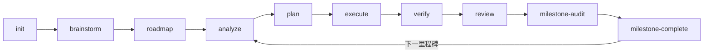

<div align="center">

# Maestro-Flow

### 多智能体时代的编排层

**不仅是执行，更是编排。**

[](https://www.typescriptlang.org/)
[](https://nodejs.org/)
[](https://modelcontextprotocol.io/)
[](LICENSE)

[English](README.md) | [简体中文](README.zh-CN.md)

</div>

---

Maestro-Flow 是一个面向 Claude Code、Codex、Gemini 等多智能体的工作流编排框架。它将软件工程中最耗时的部分——决定让哪些智能体做什么、按什么顺序、带什么上下文——自动化为一条结构化管线。你只需描述意图，Maestro-Flow 自动路由到最优命令链，驱动多个 AI 智能体并行执行，并通过实时看板、Issue 闭环和知识图谱形成完整的项目交付闭环。

---

## 它做什么

你描述你想要什么。Maestro-Flow 决定用哪些智能体、按什么顺序、带什么上下文，然后驱动它完成。

```bash
# 自然语言 -- Maestro-Flow 路由到最优命令链
/maestro "实现基于 OAuth2 的用户认证，带 refresh token"

# 或者一步步来
/maestro-init                    # 初始化项目工作区
/maestro-roadmap                 # 交互式创建路线图
/maestro-analyze                 # 多维度分析
/maestro-plan                    # 生成执行计划
/maestro-execute                 # 波次并行多智能体执行
/maestro-verify                  # 目标反推验证
```

### 里程碑管线



所有工作产物存放在 `.workflow/scratch/`，通过 `state.json` artifact registry 追踪。Phase 是 roadmap 中的标签，不是目录。

### 快速通道

| 通道 | 流程 | 适用场景 |
|------|------|---------|
| `/maestro-quick` | analyze > plan > execute | 快速修复、小功能 |
| Scratch 模式 | `analyze -q` > `plan --dir` > `execute --dir` | 不需要 roadmap，直接干 |
| `/maestro "..."` | AI 路由命令链 | 描述意图，让 Maestro-Flow 决定 |

---

## 四大支柱

### 1. 结构化管线

基于 Scratch 的里程碑工作流，通过 artifact registry 追踪进度。每个里程碑经历 analyze > plan > execute > verify > review > milestone-audit > milestone-complete。所有产物存放在 `.workflow/scratch/`，`state.json` 是唯一状态源。

49 个斜杠命令覆盖 6 大类别，驱动从项目初始化到质量复盘的每一个环节。

### 2. 自主驾驶

**Commander Agent** -- 后台运行的自主监督者:

```
评估(assess) -> 决策(decide) -> 派发(dispatch) -> 等待 -> 评估 -> ...
```

读取项目状态（阶段、任务、Issue、智能体工位），判断什么需要处理，自动派发智能体。三档配置: `conservative`、`balanced`、`aggressive`。

**Issue 闭环** -- Issue 不只是工单，它们是一条自修复管线:


| 阶段 | 命令 | 做了什么 |
|------|------|---------|
| **发现** | `/manage-issue-discover` | 8 视角扫描: Bug、UX、技术债、安全、性能、测试缺口、代码质量、文档 |
| **分析** | `/maestro-analyze --gaps` | CLI 探索式根因分析，写入 `issue.analysis` |
| **规划** | `/maestro-plan --gaps` | 生成 TASK 文件并通过 `task_refs` 关联到 Issue |
| **执行** | `/maestro-execute` | 基于 wave 的并行执行，自动同步 Issue 状态 |
| **关闭** | 自动 | 所有关联 task 完成 → resolved → closed |

质量命令（`review`、`test`、`verify`）自动为发现的问题创建 Issue。Issue 修复的代码回流到阶段管线。闭环自动关闭。

### 3. 可视化控制面板

实时项目仪表盘，运行在 `http://127.0.0.1:3001`。React 19 + Tailwind CSS 4 构建，WebSocket 实时更新。

| 视图 | 快捷键 | 你看到什么 |
|------|--------|-----------|
| **Board** | `K` | 看板列 -- Backlog、In Progress、Review、Done |
| **Timeline** | `T` | 甘特图风格的阶段时间线，带进度条 |
| **Table** | `L` | 所有阶段和 Issue 的可排序表格 |
| **Center** | `C` | 指挥中心 -- 活跃执行、Issue 队列、质量指标 |

在 Issue 卡片上选个智能体，点播放。批量选择 Issue，并行派发。实时流式面板观察智能体工作。

### 4. 智能知识库

项目随时间积累智能，通过两个系统实现:

**Wiki 知识图谱** -- 结构化条目（specs、phases、decisions、lessons）通过语义链接关联。BM25 搜索、反向链接遍历、健康评分。`/wiki-connect` 发现隐藏连接；`/wiki-digest` 生成主题聚类摘要，带覆盖热力图和缺口分析。

**学习工具箱** -- 5 个命令将代码和历史转化为可复用知识:

| 命令 | 做了什么 |
|------|---------|
| `/learn-retro` | 统一复盘 -- Git 活动指标 + 架构决策评估，通过 `--lens git\|decision\|all` 切换 |
| `/learn-follow` | 引导式跟读，带强制提问 -- 提取模式、构建理解 |
| `/learn-decompose` | 4 维度并行模式提取，保存到 specs/wiki |
| `/learn-second-opinion` | 多视角分析: review、challenge、consult 三种模式 |
| `/learn-investigate` | 系统化问题调查，假设验证 + 3 次上报机制 |

所有学习命令共享 `lessons.jsonl` -- 通过 `/manage-learn` 统一查询的知识库。Specs、复盘和手动洞察全部汇入同一个池。

---

## 引擎盖下

### 多智能体引擎

Maestro-Flow 协调多个 AI 智能体并行工作:

```
           +--------------------------------+
           |      ExecutionScheduler        |
           |    (波次并行执行引擎)            |
           +---------------+----------------+
                           |
            +--------------+--------------+
            |              |              |
      +-----+-----+ +-----+------+ +----+------+
      |  Claude    | |   Codex    | |  Gemini   |
      | Agent SDK  | |  CLI       | |  CLI      |
      +-----------+  +------------+ +-----------+
```

- **波次执行** -- 无依赖任务并行，有依赖任务等前置完成
- **Agent SDK** -- 原生 Claude Agent SDK 驱动 Claude Code 进程
- **CLI 适配器** -- Codex、Gemini、Qwen、OpenCode 通过 `maestro delegate` 调用
- **工作区隔离** -- 每个智能体获得独立执行上下文

### Hook 系统

11 个上下文感知 Hook，3 级安装:

| Hook | 用途 |
|------|------|
| `context-monitor` | 监控上下文用量，接近上限时注入警告 |
| `spec-injector` | 按 category + keyword 自动注入项目规范到子 Agent 提示词 |
| `keyword-spec-injector` | 扫描用户输入关键词，注入匹配的 `<spec-entry>` 条目 |
| `spec-validator` | 写入 `.workflow/specs/` 时验证 `<spec-entry>` 格式 |
| `delegate-monitor` | 跟踪异步 delegate 任务完成状态 |
| `team-monitor` | Collab 心跳 -- 向 `.workflow/collab/activity.jsonl` 上报活动，供队友感知 |
| `telemetry` | 执行遥测收集 |
| `session-context` | 会话启动时注入工作流状态 |
| `skill-context` | 调用工作流 Skill 时注入工作流状态 |
| `coordinator-tracker` | 跟踪协调器链进度 |
| `workflow-guard` | 保护关键文件、约束工作流行为 |

`spec-injector` 按 category 路由项目规范 -- coding Agent 获取编码约定，arch Agent 获取架构约束。`keyword-spec-injector` 提供条目级精度 -- 当用户提到 "auth" 时，只注入 auth 相关的 spec 条目。Session dedup 防止同一会话内重复注入。4 级上下文预算（full > reduced > minimal > skip）自适应注入量。

```bash
maestro hooks install --level minimal    # context-monitor + spec-injector
maestro hooks install --level standard   # + delegate/team/telemetry + session/skill-context + coordinator-tracker
maestro hooks install --level full       # + workflow-guard
```

### Overlay 系统

非侵入式地为 `.claude/commands/*.md` 打补丁 -- 增加步骤、阅读要求、质量门禁，无需编辑原始文件。Overlay 在 `maestro install` 升级后自动保留。

```bash
/maestro-overlay "在 maestro-execute 执行后增加 CLI 验证"
maestro overlay list                   # 交互式 TUI 管理
maestro overlay bundle -o team.json    # 打包分享
```

---

## 49 个命令，21 个 Agent

### 命令

| 类别 | 数量 | 前缀 | 用途 |
|------|------|------|------|
| **核心工作流** | 20 | `maestro-*` | 全生命周期 -- init、brainstorm、roadmap、analyze、plan、execute、verify、coordinate、milestones、overlays、UI design |
| **管理** | 12 | `manage-*` | Issue 生命周期、代码库文档、知识捕获、记忆管理、harvest、status |
| **质量** | 9 | `quality-*` | review、test、debug、test-gen、integration-test、business-test、refactor、retrospective、sync |
| **学习** | 5 | `learn-*` | 统一复盘、跟读学习、模式拆解、系统探究、多视角分析 |
| **规范** | 3 | `spec-*` | setup、add、load |
| **知识图谱** | 2 | `wiki-*` | 连接发现、知识摘要 |

### Agent

`.claude/agents/` 下 21 个专业化 Agent 定义 -- 每个是聚焦的 Markdown 文件，Claude Code 按需加载。包括 `workflow-planner`、`workflow-executor`、`issue-discover-agent`、`workflow-debugger`、`workflow-verifier`、`team-worker` 等。

---

## 快速开始

### 前置条件

- Node.js >= 18
- [Claude Code](https://claude.com/code) CLI
- (可选) Codex CLI、Gemini CLI 用于多智能体工作流

### 安装

```bash
npm install -g maestro-flow

# 安装 workflows、commands、agents、templates
maestro install
```

### 第一次运行

```bash
/maestro-init                  # 初始化项目
/maestro-roadmap               # 创建路线图
/maestro-plan 1                # 规划第一阶段
/maestro-execute 1             # 多智能体执行

# 或者直接:
/maestro "搭建用户管理的 REST API"
```

### 仪表盘

```bash
maestro serve                  # -> http://127.0.0.1:3001
maestro view                   # 终端 TUI 替代方案
```

### MCP 服务器

```bash
# Claude Code -- 加载为开发 MCP 服务器
claude --dangerously-load-development-channels server:maestro --dangerously-skip-permissions

# stdio 传输 (Claude Desktop 和其他 MCP 客户端)
npm run mcp
```

### 工作流启动器

```bash
maestro launcher               # 交互式工作流 + 设置选择器
maestro launcher list           # 查看已注册的工作流
```

---

## 架构

```
maestro/
+-- bin/                     # CLI 入口
+-- src/                     # 核心 CLI (Commander.js + MCP SDK)
|   +-- commands/            # 11 个 CLI 命令 (serve, run, cli, ext, tool, ...)
|   +-- mcp/                 # MCP 服务器 (stdio 传输)
|   +-- core/                # 工具注册、扩展加载器
+-- dashboard/               # 实时 Web 仪表盘
|   +-- src/
|       +-- client/          # React 19 + Zustand + Tailwind CSS 4
|       +-- server/          # Hono API + WebSocket + SSE
|       |   +-- agents/      # AgentManager + 适配器
|       |   +-- commander/   # 自主 Commander Agent
|       |   +-- execution/   # ExecutionScheduler + WaveExecutor
|       +-- shared/          # 共享类型
+-- .claude/
|   +-- commands/            # 49 个斜杠命令 (.md)
|   +-- agents/              # 21 个 Agent 定义 (.md)
+-- workflows/               # 47 个工作流实现 (.md)
+-- templates/               # JSON 模板 (task, plan, issue, ...)
+-- extensions/              # 插件系统
```

### 技术栈

| 层级 | 技术 |
|------|------|
| CLI | Commander.js, TypeScript, ESM |
| MCP | @modelcontextprotocol/sdk (stdio) |
| 前端 | React 19, Zustand, Tailwind CSS 4, Framer Motion, Radix UI |
| 后端 | Hono, WebSocket, SSE |
| 智能体 | Claude Agent SDK, Codex CLI, Gemini CLI, OpenCode |
| 构建 | Vite 6, TypeScript 5.7, Vitest |

---

## 文档

- **[命令使用指南](guide/command-usage-guide.md)** -- 全部 49 个命令，含工作流图表、管线衔接、Issue 闭环、快速通道
- **[Spec 系统指南](guide/spec-system-guide.md)** -- `<spec-entry>` 闭合标签格式、keyword 加载、验证 Hook、session dedup 注入
- **[Delegate 异步执行指南](guide/delegate-async-guide.md)** -- 异步任务委派: CLI & MCP 用法、消息注入、链式调用、Broker 生命周期
- **[Overlay 系统指南](guide/overlay-guide.md)** -- 非侵入式命令扩展: overlay 格式、section 注入、bundle 打包/导入、交互式 TUI 管理
- **[Hook 系统指南](guide/hooks-guide.md)** -- Hook 系统架构、11 个 Hook、Spec 注入、上下文预算、配置
- **[Worktree 并行开发指南](guide/worktree-guide.md)** -- 里程碑级 worktree 并行: fork、sync、merge、scope 保护、Dashboard 集成
- **[Collab 协作 -- 使用指南](guide/team-lite-guide.md)** -- 2-8 人小团队协作: 加入、同步、活动感知、冲突预检、任务管理、命名空间隔离
- **[Collab 协作 -- 设计文档](guide/team-lite-design.md)** -- 架构、数据模型、人类协作域 (`.workflow/collab/`) 与智能体管线 (`.workflow/.team/`) 的命名空间边界
- **[MCP 工具参考](guide/mcp-tools-guide.md)** -- 全部 9 个 MCP 端点工具：文件操作 (edit/write/read)、团队协作 (msg/mailbox/task/agent)、持久记忆
- **[CLI 命令参考](guide/cli-commands-guide.md)** -- 全部 21 个终端命令 — 安装、委派、协调、Wiki、Hook、Overlay、协作等

---

## 致谢

- **[GET SHIT DONE](https://github.com/gsd-build/get-shit-done)** by TACHES -- 规格驱动开发模型和上下文工程理念，塑造了 Maestro-Flow 的管线设计。
- **[Claude-Code-Workflow](https://github.com/catlog22/Claude-Code-Workflow)** -- 前身项目，开创了多 CLI 编排和 skill 路由工作流。

## 贡献者

<a href="https://github.com/catlog22">
  
</a>

**[@catlog22](https://github.com/catlog22)** -- 创建者 & 维护者

## 交流群

欢迎加入微信群交流反馈:


## 友情链接

- [Linux DO：学AI，上L站！](https://linux.do/)

## 许可证

MIT
