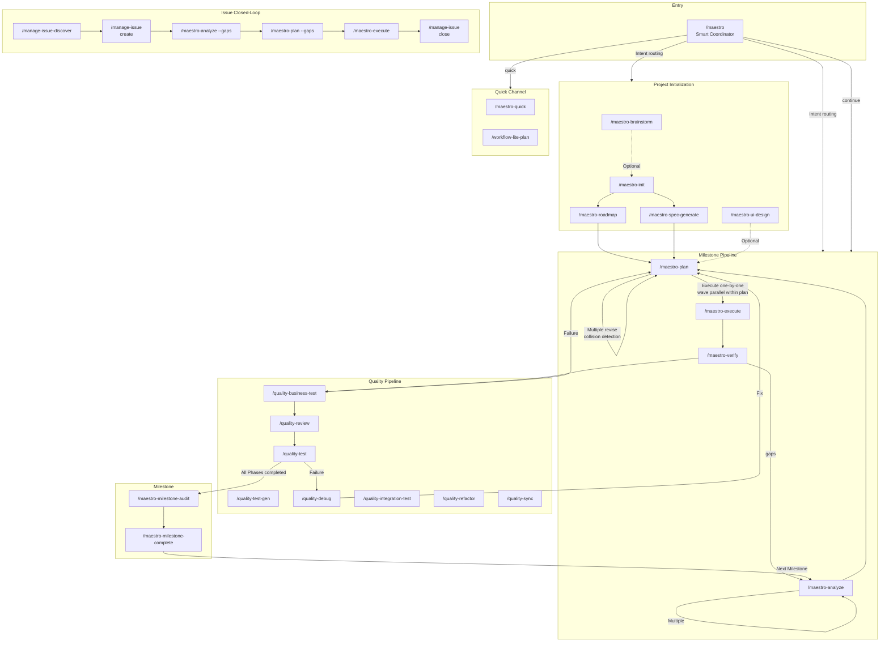
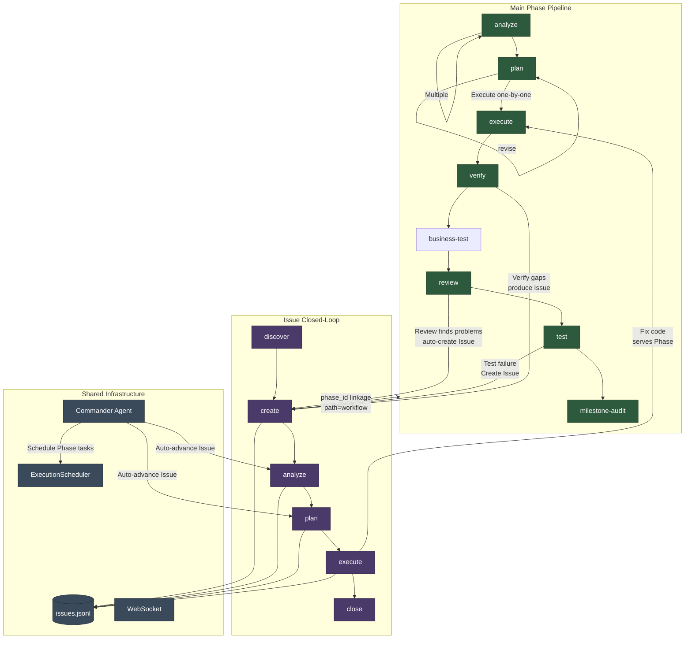
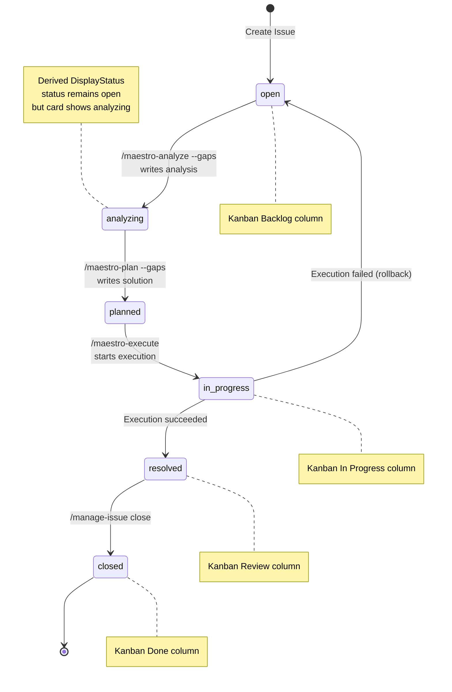
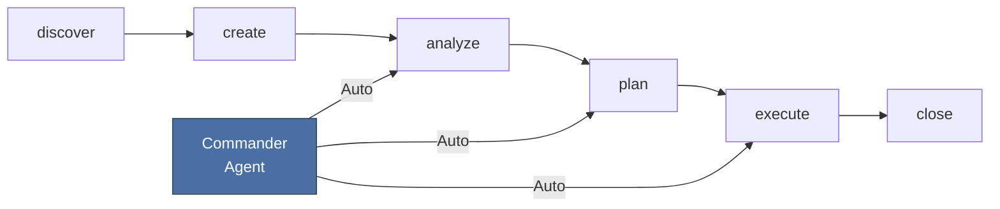
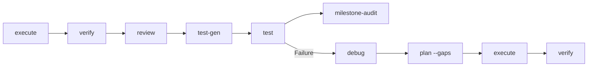

# Maestro-Flow Command Usage Guide

The Maestro-Flow command system includes 49 slash commands, organized into 6 major categories. This document covers the main pipeline command sequencing, quick channels, the Issue closed-loop workflow, learning toolkit, and the usage scenarios for each command.

## Command Overview

| Category | Count | Prefix | Responsibility |
|----------|-------|--------|----------------|
| **Core Workflow** | 16 | `maestro-*` | Project initialization, planning, execution, verification, coordination, milestones, overlays |
| **Management** | 12 | `manage-*` | Issue lifecycle, codebase documentation, knowledge capture, memory, harvest, status |
| **Quality** | 9 | `quality-*` | Code review, business testing, UAT, debugging, refactoring, retrospective, sync |
| **Specification** | 3 | `spec-*` | Project spec initialization, loading, entry |
| **Learning** | 5 | `learn-*` | Unified retro (git+decision), follow-along, pattern decompose, investigate, second opinion |
| **Wiki** | 2 | `wiki-*` | Connection discovery, knowledge digest |

The global entry point `/maestro` is the smart coordinator that automatically selects the optimal command chain based on user intent and project state.

### Command Panorama



### Interaction Between Main Pipeline and Issues



> **Key relationship overview**: The Phase pipeline and Issue closed-loop are two parallel workflows interconnected through the following mechanisms:
>
> 1. **Phase to Issue (problem production)**: `quality-review` automatically creates Issues for critical/high severity findings during code review; `quality-business-test` produces Issues on business rule failures (with REQ traceability); `quality-test` produces Issues on failure; `maestro-verify` can associate Issues when gaps are found
> 2. **Issue to Phase (fix injection)**: Issues link to specific Phases via the `phase_id` field, with `path=workflow` indicating the Issue belongs to the Phase pipeline context; code modified during Issue execution serves the owning Phase
> 3. **Commander bidirectional orchestration**: Commander Agent manages both Phase task scheduling (via ExecutionScheduler) and Issue closed-loop advancement (via AgentManager), forming a unified automation scheduling layer
> 4. **Shared storage**: Both workflows share `issues.jsonl` storage and WebSocket real-time communication

### Two Issue Processing Paths

The Issue `path` field distinguishes two processing paths:

| path | Meaning | Source | Lifecycle |
|------|---------|--------|-----------|
| `standalone` | Independent Issue, not bound to a Phase | Manual creation, `/manage-issue-discover`, external import | Independent closed-loop, does not affect Phase progression |
| `workflow` | Phase-linked Issue | `quality-review` auto-create, `quality-business-test` failure, Phase verification output | May block milestone completion |

- `standalone` Issues are displayed independently on the kanban board, resolved through the Issue closed-loop (analyze, plan, execute)
- `workflow` Issues carry a `phase_id` and are displayed alongside their corresponding Phase column on the kanban board; their resolution status may affect milestone completion

```mermaid
graph LR
    subgraph standalone_path["standalone path"]
        S1["Manual create /<br>discover found"] --> S2["Independent closed-loop<br>analyze→plan→execute"]
        S2 --> S3["close"]
    end

    subgraph workflow_path["workflow path"]
        W1["review/verify/test<br>auto-create"] --> W2["Link to Milestone<br>milestone=M1"]
        W2 --> W3["Issue closed-loop fix"]
        W3 --> W4["Re-verification"]
        W4 --> W5["milestone-audit"]
    end

    style standalone_path fill:#1a1a2e,stroke:#4a4a6a
    style workflow_path fill:#1a2e1a,stroke:#4a6a4a
```



### Issue Closed-Loop State Transitions



### Milestone Workflow State (Artifact Registry)

```mermaid
stateDiagram-v2
    [*] --> no_artifacts: Milestone starts
    no_artifacts --> analyzed: /maestro-analyze → ANL artifact
    analyzed --> analyzed: Re-analyze (multiple)
    analyzed --> planned: /maestro-plan → PLN artifact
    planned --> planned: Plan revise / collision check
    planned --> executed: /maestro-execute → EXC artifact
    executed --> verified: /maestro-verify → VRF artifact
    verified --> audited: /maestro-milestone-audit
    audited --> completed: /maestro-milestone-complete
    completed --> [*]

    verified --> analyzed: Gaps found → re-analyze
    verified --> planned: Gaps found → plan --gaps
    executed --> planned: Failure → debug → plan --gaps

    note right of analyzed: scratch/YYYYMMDD-analyze-PN-slug/<br/>Multiple analyze with different scopes
    note right of planned: scratch/YYYYMMDD-plan-PN-slug/<br/>Collision detection: file overlap warning
    note right of executed: .summaries/ written to plan dir<br/>Execute plans one-by-one, wave parallel within plan
    note right of verified: verification.json written to plan dir
```

**Core design**: Phase = label, not directory. All artifacts live in `.workflow/scratch/`, tracked by `state.json.artifacts[]`. Each step produces an artifact entry (ANL/PLN/EXC/VRF) forming a dependency chain. Supports multiple analyze → multiple plan (with collision detection) → execute one-by-one (serial between plans, wave parallel within plan).

---

## 1. Main Workflow (Milestone Pipeline)

The main workflow progresses the project in units of **Phase**, with each Phase going through a complete lifecycle pipeline.

### 1.1 Project Initialization

```
/maestro-init → /maestro-roadmap or /maestro-spec-generate
```

| Step | Command | Purpose | Output |
|------|---------|---------|--------|
| 0 | `/maestro-brainstorm` (optional) | Multi-role brainstorming | guidance-specification.md |
| 1 | `/maestro-init` | Initialize .workflow/ directory | state.json, project.md, specs/ |
| 2a | `/maestro-roadmap` | Lightweight roadmap (interactive) | roadmap.md (phases as labels) |
| 2b | `/maestro-spec-generate` | Full specification chain (7 stages) | PRD + architecture docs + roadmap.md |
| (optional) | `/maestro-ui-design` | UI design prototype | design-ref/ tokens |

**Choosing 2a vs 2b**: Use roadmap for small projects or when requirements are clear; use spec-generate for large projects or when complete specification documents are needed.

### 1.2 Milestone Pipeline (Scratch-Based Artifact Registry)

```
/maestro-analyze → /maestro-plan → /maestro-execute → /maestro-verify → /quality-review → /maestro-milestone-audit → /maestro-milestone-complete
```

| Stage | Command | Input | Output | Artifact |
|-------|---------|-------|--------|----------|
| Analyze | `/maestro-analyze` | roadmap + project.md | context.md, analysis.md | ANL-{NNN} |
| Plan | `/maestro-plan` | context.md (from ANL) | plan.json + TASK-*.json | PLN-{NNN} |
| Execute | `/maestro-execute` | plan.json | .summaries/, code changes | EXC-{NNN} |
| Verify | `/maestro-verify` | .summaries/ | verification.json | VRF-{NNN} |
| Review | `/quality-review` | code changes | review.json | REV-{NNN} |
| Debug | `/quality-debug` | review findings / user feedback | understanding.md | DBG-{NNN} |
| Test | `/quality-test` | verification criteria | uat.md | TST-{NNN} |
| Audit | `/maestro-milestone-audit` | artifact registry | audit-report.md | — |
| Complete | `/maestro-milestone-complete` | audit passed | archived to milestones/ | — |

**All output paths**: `scratch/YYYYMMDD-{type}[-P{N}|-M{N}]-{slug}/` — date-first for chronological sorting, scope prefix P{N}/M{N} as state.json fallback identifier. No more `.workflow/phases/` directories.

**Scope routing**: No args = entire milestone; number = specific phase; text = adhoc/standalone.

#### Scope Routing Details

Each pipeline command (analyze/plan/execute/verify) supports 4 scopes:

| Invocation | Prerequisites | scope | Description |
|------------|--------------|-------|-------------|
| `analyze` (no args) | init + roadmap | `milestone` | Covers all phases in current milestone |
| `analyze 1` | init + roadmap | `phase` | Only process phase 1 |
| `analyze "topic"` (with milestone) | None | `adhoc` | Analyze any topic, linked to current milestone |
| `analyze "topic"` (no milestone) | None | `standalone` | Analyze any topic, not linked to milestone |
| `plan --dir scratch/xxx` | None | Inherits upstream scope | Specify analyze output path directly |
| `execute --dir scratch/xxx` | None | Inherits upstream scope | Execute specified plan directly |

**Scope determination**: When a text argument is provided, if `state.json.current_milestone` is non-null → `adhoc`, otherwise → `standalone`.
No-argument invocation without roadmap → error, prompting for a topic argument or roadmap creation first.

#### Five Usage Modes

**Mode A — One-shot (full milestone)**

Each step covers all phases in the current milestone by default. One plan contains all phases' tasks.

```
analyze → plan → execute → verify
```

**Mode B — Per-phase analyze/plan, per-phase execute**

Each plan is executed independently, no aggregation.

```
analyze 1 → plan 1 → execute 1
analyze 2 → plan 2 → execute 2
verify
```

**Mode C — Mixed**

```
analyze                  ← full milestone analysis
plan 1 → execute 1       ← do phase 1 first
plan 2 → execute 2       ← then phase 2
analyze "hotfix" → plan --dir → execute --dir   ← ad-hoc mid-stream
verify
```

**Mode D — Analyze first, unified plan/execute**

```
analyze 1
analyze 2
plan                     ← full milestone plan (consumes all analyze outputs)
execute                  ← execute that plan
```

**Mode E — No init / no roadmap (pure scratch)**

No init or roadmap needed. All commands work independently. state.json is auto-created on demand.

```
analyze "implement auth"         ← scope=standalone
plan --dir scratch/analyze-xxx   ← specify analyze output directly
execute --dir scratch/plan-xxx   ← execute directly
```

### 1.3 Gap Fix Loop

When verification or testing finds gaps:

```
/maestro-verify (gaps found) → /maestro-plan --gaps → /maestro-execute → /maestro-verify (re-check)
/quality-business-test (business rule failure) → /quality-debug --from-business-test → /maestro-plan --gaps → re-execute
/quality-test --auto-fix (failure) → /quality-debug → /maestro-plan --gaps → re-execute
```

### 1.4 Milestone Management

When all Phases of a milestone are completed:

```
/maestro-milestone-audit → /maestro-milestone-complete
```

- `milestone-audit`: Cross-Phase integration verification, checking inter-module dependencies and interface consistency
- `milestone-complete`: Archive the milestone and advance to the next one

### 1.5 Using the Maestro Coordinator

All of the above sequencing can be orchestrated automatically via `/maestro`:

```bash
/maestro "Implement user authentication module"          # Intent recognition → auto-select command chain
/maestro continue                    # Auto-execute next step based on state.json
/maestro -y "Add OAuth support"        # Fully automatic mode (skip all interactive confirmations)
/maestro --chain full-lifecycle      # Force use of the full lifecycle chain
/maestro status                      # Quick view of project status
```

**Available command chains**:

| Chain Name | Command Sequence | Use Case |
|------------|------------------|----------|
| `full-lifecycle` | init→spec-generate→plan→execute→verify→review→test→milestone-audit | Brand new project |
| `spec-driven` | init→spec-generate→... | Requires full specification |
| `roadmap-driven` | init→roadmap→... | Lightweight roadmap |
| `brainstorm-driven` | brainstorm→init→roadmap→... | Start from brainstorming |
| `ui-design-driven` | ui-design→plan→execute→verify | UI design driven |
| `analyze-plan-execute` | analyze→plan→execute | Quick analyze-plan-execute |
| `execute-verify` | execute→verify | Plan already exists, execute directly |
| `quality-loop` | review→test→debug | Quality pipeline |
| `milestone-close` | milestone-audit→milestone-complete | Close a milestone |
| `quick` | quick task | Instant small tasks |

---

## 2. Quick Channel (Scratch Mode)

Bypasses the Phase pipeline and completes tasks directly in a scratch directory.

### 2.1 Quick Tasks

```bash
/maestro-quick "Fix login page bug"              # Shortest path, skip optional agents
/maestro-quick --full "Refactor API layer"            # With plan-checker validation
/maestro-quick --discuss "Database migration strategy"       # With decision extraction (Locked/Free/Deferred)
```

Output is stored in `.workflow/scratch/{task-slug}/`, without affecting the main Phase pipeline.

### 2.2 Quick Analyze + Plan + Execute

```bash
/maestro-analyze -q "Performance optimization"    # Quick mode, decision extraction only → generates context.md
/maestro-plan --dir .workflow/scratch/xxx   # Plan against scratch directory
/maestro-execute --dir .workflow/scratch/xxx  # Execute against scratch directory
```

The `--dir` parameter skips roadmap validation and works directly in the specified directory.

### 2.3 Lite Plan Workflow (Skill Level)

A lighter plan-execute chain via the Skill system's `workflow-lite-plan`:

```bash
/workflow-lite-plan "Implement Issue closed-loop system"    # explore→clarify→plan→confirm→execute→test-review
```

Automatic chaining: `lite-plan → lite-execute → lite-test-review`, managed entirely under `.workflow/.lite-plan/`.

### 2.4 Standalone Mode (No Init Required)

No `maestro-init` or `maestro-roadmap` needed. Just run commands directly. state.json is auto-created.

```bash
/maestro-analyze "Implement JWT authentication"              # scope=standalone, state.json auto-bootstraps
/maestro-plan --dir scratch/20260420-analyze-jwt-...         # Plan against analyze output
/maestro-execute --dir scratch/20260420-plan-jwt-...         # Execute directly
```

Standalone artifacts are not linked to any milestone and do not affect the main pipeline.

### 2.5 Scratch Cleanup

```bash
maestro scratch gc                # Clean up standalone scratch dirs older than 30 days
maestro scratch gc --days 7       # Clean up older than 7 days
maestro scratch gc --dry-run      # Preview directories to be cleaned
```

**Cleanup conditions**: `scope=standalone` + `status=completed` + `harvested=true` (experience extracted) + older than specified days.

---

## 3. Issue Closed-Loop Workflow

The Issue system runs in parallel with the Phase pipeline. It can operate as an independent closed-loop or deeply integrate with Phases.

**Relationship with the main pipeline** (see "Interaction Between Main Pipeline and Issues" in the Command Panorama):
- **Phase produces Issues**: `quality-review` automatically creates Issues for critical/high findings during review (auto-issue creation); `quality-business-test` creates Issues on business rule failures (with REQ traceability); `quality-test` creates Issues on failure; gaps from `maestro-verify` can also be converted to Issues
- **Issue fixes inject back into Phase**: Issues with `phase_id` (`path=workflow`) serve the Phase after fix execution; re-verify and re-test are required before milestone-audit
- **Standalone Issues do not block Phases**: `path=standalone` Issues are resolved through the Issue closed-loop independently, without affecting Phase progression
- **Commander unified scheduling**: Commander Agent drives both Phase tasks and Issue closed-loop, auto-scheduling with priority order `execute > analyze > plan`

### 3.1 Issue Lifecycle

```
Discover → Create → Analyze → Plan → Execute → Close
```

```
/manage-issue-discover                          # Auto-discover problems
       ↓
/manage-issue create --title "..." --severity high   # Create Issue
       ↓
/maestro-analyze --gaps ISS-xxx                  # Root cause analysis → writes analysis
       ↓
/maestro-plan --gaps                             # Solution planning → TASK-*.json + issue.task_refs[]
       ↓
/maestro-execute                                 # Execute solution → TASK completed + issue resolved
       ↓
/manage-issue close ISS-xxx --resolution "fixed" # Close Issue
```

### 3.2 Command Details

#### `/manage-issue-discover` — Problem Discovery

Two modes:

```bash
/manage-issue-discover                        # Full 8-perspective scan (security/performance/reliability/maintainability/scalability/UX/accessibility/compliance)
/manage-issue-discover by-prompt "Check error handling in APIs" # Targeted discovery by prompt
```

Output: Deduplicated Issue list, automatically written to `issues.jsonl`.

#### `/manage-issue` — CRUD Operations

```bash
/manage-issue create --title "Memory leak" --severity high --source discovery
/manage-issue list --status open --severity high
/manage-issue status ISS-xxx
/manage-issue update ISS-xxx --priority urgent --tags "perf,memory"
/manage-issue close ISS-xxx --resolution "Fixed in commit abc123"
/manage-issue link ISS-xxx --task TASK-001      # Bidirectional link Issue ↔ Task
```

#### `/maestro-analyze --gaps` — Issue Root Cause Analysis

```bash
/maestro-analyze --gaps ISS-xxx                  # Analyze Issue root cause (uses gemini by default)
/maestro-analyze --gaps ISS-xxx --tool qwen --depth deep  # Specify tool and depth
```

Flow: Read Issue → CLI codebase exploration → Identify root cause → Write to `issue.analysis` field (root_cause, impact, confidence, related_files, suggested_approach).

After analysis, the Issue's display status changes from `open` to `analyzing` (diagnosed).

#### `/maestro-plan --gaps` — Issue Solution Planning

```bash
/maestro-plan --gaps                             # Generate TASK-*.json from diagnosed Issues
/maestro-plan --gaps --from-analysis              # Explicitly use analysis results
```

Flow: Read Issue + analysis → CLI planning → Generate TASK-*.json files → Update `issue.task_refs[]` with task references.

After planning, the Issue's display status changes from `analyzing` to `planned`.

#### `/maestro-execute` — Unified Execution (Issues + Tasks)

```bash
/maestro-execute                                 # Execute all pending TASKs (including Issue-linked)
/maestro-execute --dry-run                        # Dry run (no actual execution)
```

**Unified data flow**: Issues produce TASKs via `--gaps` planning; `maestro-execute` runs TASKs and marks linked Issues as resolved on completion.

### 3.3 Issue and Kanban Integration

How Issues appear on the Dashboard kanban board:

| Issue Status | Kanban Column | Display Status | Card Features |
|-------------|---------------|----------------|---------------|
| `open` (no analysis) | Backlog | `open` (gray) | Type + priority badge |
| `open` + analysis | Backlog | `analyzing` (blue) | + analysis marker |
| `open` + solution | Backlog | `planned` (purple) | + "N steps" indicator |
| `in_progress` | In Progress | `in_progress` (yellow) | + execution status animation |
| `resolved` | Review | `resolved` (green) | Completion marker |
| `closed` | Done | `closed` (gray) | Archived |

The **path badge** on IssueCard identifies the Issue source:
- `standalone` — Independent Issue (manually created or discovered)
- `workflow` — Phase-linked Issue (auto-created by review/verify/test, with `phase_id`)

Available actions on the kanban board:
- **Analyze/Plan/Execute buttons** → Click in Issue detail modal, triggers backend Agent via WebSocket
- **Executor selector** → Hover on IssueCard to display, choose Claude/Codex/Gemini
- **Batch execution** → Multi-select Issues then use ExecutionToolbar

### 3.4 Commander Agent Automation

Commander Agent acts as an autonomous supervisor that can automatically advance the Issue closed-loop without manual intervention:

1. Finds `open` Issues without `analysis` → auto-triggers `analyze_issue`
2. Finds Issues with `analysis` but no `solution` → auto-triggers `plan_issue`
3. Executes in priority order: `execute > analyze > plan`

This means Issues can be fully automated through the analyze, plan, execute closed-loop by Commander after creation.

---

## 4. Quality Pipeline

Quality commands typically run after Phase execution, but can also be used independently.

### 4.1 Standard Quality Flow

```
/maestro-execute → /maestro-verify → /quality-business-test → /quality-review → /quality-test-gen → /quality-test → /maestro-milestone-audit
```

### 4.2 Command Descriptions

| Command | Purpose | Parameters | Typical Scenario |
|---------|---------|------------|------------------|
| `/quality-business-test {N}` | PRD-forward business testing | `--spec` `--layer L1\|L2\|L3` `--gen-code` `--dry-run` `--re-run` `--auto` | Extract scenarios from REQ acceptance criteria, progressive L1 Interface → L2 Business Rule → L3 Scenario |
| `/quality-review {N}` | Tiered code review | `--level quick\|standard\|deep` | Review code quality after execution |
| `/quality-test-gen {N}` | Test generation | `--layer unit\|e2e\|all` | Nyquist coverage analysis + RED-GREEN |
| `/quality-test {N}` | Session-based UAT | `--smoke` `--auto-fix` | Acceptance testing + auto-fix loop |
| `/quality-debug` | Hypothesis-driven debugging | `--from-uat {N}` `--from-business-test {N}` `--parallel` | Root cause analysis after test failure |
| `/quality-integration-test {N}` | Integration testing | `--max-iter N` `--layer L0-L3` | L0-L3 progressive integration testing |
| `/quality-refactor` | Technical debt remediation | `[scope]` | Reflection-driven refactoring iteration |
| `/quality-sync` | Documentation sync | `--since HEAD~N` | Sync documentation after code changes |

### 4.3 Three-Track Testing

Three test commands verify from different angles — complementary, not replacements:

| Command | Input Source | Verification Angle |
|---------|-------------|-------------------|
| `/quality-business-test` | REQ-*.md acceptance criteria | **PRD-forward** — are business rules satisfied? |
| `/quality-test` | verification.json must_haves | **Code-backward** — does the code work? |
| `/quality-test-gen` | validation.json gaps | **Coverage-backward** — is coverage sufficient? |

### 4.4 Debug Loop

```
/quality-business-test (business rule failure) → /quality-debug --from-business-test {N} → fix → /quality-business-test --re-run (re-verify)
/quality-test (failure found) → /quality-debug --from-uat {N} → fix → /quality-test (re-verify)
```

`quality-debug` supports parallel hypothesis verification (`--parallel`), using the scientific method (hypothesis, experiment, verification) for root cause analysis.

---

## 5. Specification and Knowledge Management

### 5.1 Specification Management

```bash
/spec-setup                          # Scan project for conventions (auto for existing projects, optional for new)
/spec-add arch "Use JSONL format for Issue storage"  # Record a design decision
/spec-add coding "All API endpoints use the Hono framework"  # Record a code pattern
/spec-load --category arch       # Load planning-related specs (called before agent execution)
```

Types: `bug` / `pattern` / `decision` / `rule` / `debug` / `test` / `review` / `validation`

### 5.2 Codebase Documentation

```bash
/manage-codebase-rebuild             # Full rebuild of .workflow/codebase/ docs
/manage-codebase-refresh             # Incremental refresh (based on git diff)
```

### 5.3 Memory Management

```bash
/manage-knowhow-capture compact       # Compact current knowhow
/manage-learn tip "Always use bun instead of npm" --tag tooling
/manage-knowhow list --store workflow --tag tooling
/manage-knowhow search "authentication"
```

### 5.4 Status View

```bash
/manage-status                       # Project dashboard (progress, active tasks, next step suggestions)
```

---

## 6. Command Sequencing Quick Reference

### Main Phase Pipeline

graph LR
    INIT[init] --> RM["roadmap /<br>spec-generate"]
    RM -.-> UID["ui-design<br>(Optional)"]
    RM --> AN[analyze]
    UID -.-> AN
    AN -->|"Multiple"| AN
    AN --> PL[plan]
    PL -->|"revise / collision check"| PL
    PL -->|"Execute one-by-one"| EX[execute]
    EX --> VF[verify]
    VF --> QBT[business-test]
    QBT --> QR[review]
    QR --> QT[test]
    QT --> MA[milestone-audit]
    VF -->|"gaps"| AN
    QBT -->|"Failure"| PL
    QT -->|"Failure"| PL
```

### Issue Closed-Loop



### Quality Pipeline



### Quick Channel

graph LR
    subgraph quick["Quick Task"]
        MQ["/maestro-quick"]
    end

    subgraph scratch["Scratch Mode"]
        AQ["/maestro-analyze -q"] --> PD["/maestro-plan --dir"]
        PD --> ED["/maestro-execute --dir"]
    end

    subgraph lite["Lite Chain"]
        LP["/workflow-lite-plan"] --> LE[lite-execute]
        LE --> LT[lite-test-review]
    end

    subgraph standalone["Standalone (no init)"]
        SA["analyze topic"] --> SP["plan --dir"]
        SP --> SE["execute --dir"]
    end
```

---

## 7. Common Workflow Examples

### New Project from Scratch

```bash
/maestro-brainstorm "Online education platform"
/maestro-init --from-brainstorm ANL-xxx
/maestro-roadmap "Create roadmap based on brainstorm results" -y
/maestro-plan 1
/maestro-execute 1
/maestro-verify 1
/maestro-milestone-audit
/maestro-milestone-complete
```

### One-Click Fully Automatic

```bash
/maestro -y "Implement user authentication system"
# Auto-executes: init → roadmap → plan → execute → verify → review → test → milestone-audit
```

### Discover and Fix Problems

```bash
/manage-issue-discover by-prompt "Check error handling in all API endpoints"
/maestro-analyze --gaps ISS-xxx
/maestro-plan --gaps
/maestro-execute
/manage-issue close ISS-xxx --resolution "Fixed"
```

---

## Wiki Knowledge Graph System

The Wiki system is Maestro's knowledge indexing core. It unifies markdown files and JSONL rows under `.workflow/` as `WikiEntry` nodes, supporting BM25 search, graph analysis, and persistent indexing.

### Node Types

| Type | Source | Write Permission | Description |
|------|--------|-----------------|-------------|
| `project` | `project.md` | Read-only | Project description |
| `roadmap` | `roadmap.md` | Read-only | Roadmap |
| `spec` | `specs/<slug>.md` | Writable | Spec documents |
| `knowhow` | `knowhow/KNW-<slug>.md` | Writable | Knowhow entry (created by `/manage-knowhow-capture`) |
| `note` | `memory/TIP-<slug>.md` | Writable | Quick notes |
| `issue` | `issues/*.jsonl` rows | Read-only (virtual) | Issue tracking |
| `lesson` | `learning/*.jsonl` rows | Read-only (virtual) | Learning insights |

### Entry Fields

Each WikiEntry has 4 provenance fields beyond the basics (id, title, tags, status, related):

| Field | Purpose | Example |
|-------|---------|---------|
| `category` | Content classification | `security`, `debug`, `learning`, `arch` |
| `createdBy` | Command that created the entry | `memory-capture`, `manage-harvest`, `manual` |
| `sourceRef` | Source anchor | `WFS-auth-001`, `HRV-a1b2c3d4`, `commit:abc123` |
| `parent` | Parent entry ID (hierarchy) | `spec-auth-patterns` |

### CLI Commands

```bash
# Listing + filters
maestro wiki list                                    # All entries
maestro wiki list --type spec                        # By type
maestro wiki list --category security                # By category
maestro wiki list --created-by manage-harvest        # By creator
maestro wiki list --tag auth --status active          # Combined filters
maestro wiki list --group                            # Group by type

# Search (BM25 full-text)
maestro wiki search "authentication token"

# Create (spec / memory / note)
maestro wiki create --type spec --slug auth-patterns \
  --title "Auth Patterns" --body "# Auth\n..." \
  --category security --created-by manual \
  --source-ref "session-001" --parent "spec-coding-conventions" \
  --frontmatter '{"tags":["auth"]}'

# Spec entry operations (unified write path)
maestro wiki append spec-learnings --category bug --body "Cache invalidation issue"
maestro wiki append spec-coding-conventions --category coding \
  --body "Use named exports for utility functions" --keywords "exports,module"
maestro wiki remove-entry spec-learnings-003         # Remove sub-entry by ID

# Update / delete
maestro wiki update spec-auth-patterns --title "New Title"  # frontmatter only
maestro wiki delete spec-auth-patterns

# Graph analysis
maestro wiki health                                  # Health score (0-100)
maestro wiki orphans                                 # Orphan nodes
maestro wiki hubs --limit 10                         # Hub nodes
maestro wiki backlinks spec-auth                     # Who references it
maestro wiki forward spec-auth                       # What it references
maestro wiki graph                                   # Full graph JSON
```

### Spec Atomic Node Indexing

WikiIndexer parses each `<spec-entry>` block into an independent WikiEntry sub-node (e.g. `spec-learnings-001`), with `parent` pointing to the container node (e.g. `spec-learnings`). This means:

- **BM25 search** locates specific entries (not whole files)
- **Graph analysis** operates at entry granularity (sub-nodes can be linked and analyzed)
- **Keyword surfacing**: sub-node keywords are automatically merged into the container's frontmatter, making `--tag` filtering work

### Spec Write Protection

`wiki update` returns 403 (FORBIDDEN) for body updates on `specs/*.md` files. Use entry-level operations:

- `maestro wiki append <containerId>` — append a `<spec-entry>` block
- `maestro wiki remove-entry <entryId>` — surgically remove a sub-entry

### Persistent Index

After every create/update/delete, the system generates `.workflow/wiki-index.json` (lightweight, no body):

```json
{
  "version": 2,
  "generatedAt": 1777096303681,
  "entries": [
    {
      "id": "spec-auth-patterns",
      "type": "spec",
      "title": "Auth Patterns",
      "category": "security",
      "createdBy": "manual",
      "sourceRef": "session-001",
      "parent": null,
      "tags": ["auth"],
      "status": "active",
      "related": [],
      "source": { "kind": "file", "path": "specs/auth-patterns.md" }
    }
  ]
}
```

### Graph Connections

Entries are connected through three mechanisms:

- **`related` frontmatter** — explicitly declared bidirectional links: `related: ["[[spec-auth]]"]`
- **`[[wikilink]]`** — inline references in body, automatically resolved as forward links
- **`parent`** — hierarchical relationship, automatically counted as child → parent forward link

Health score formula: `score = max(0, 100 − 2×brokenLinks − 1×orphans − 3×missingTitles)`

---

### Quick Fix a Bug

```bash
/maestro-quick "Fix login page layout issues on mobile"
```

### Test Failure After Phase Execution

```bash
/quality-business-test 3             # PRD-forward business testing (L1→L2→L3)
/quality-test 3                     # Session-based UAT
# If failures found:
/quality-debug --from-business-test 3  # Diagnose from business test failures
/maestro-plan 3 --gaps              # Generate fix plan
/maestro-execute 3                  # Execute fix
/quality-business-test 3 --re-run   # Re-run only failed scenarios
/maestro-milestone-audit            # Audit milestone after passing
```
