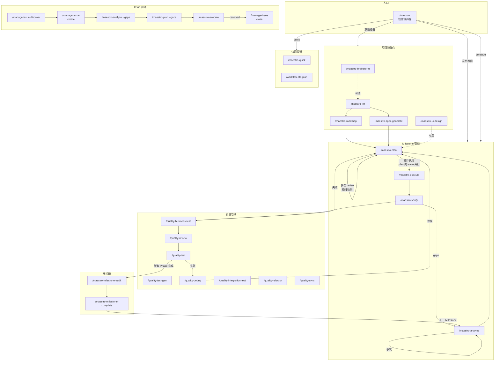
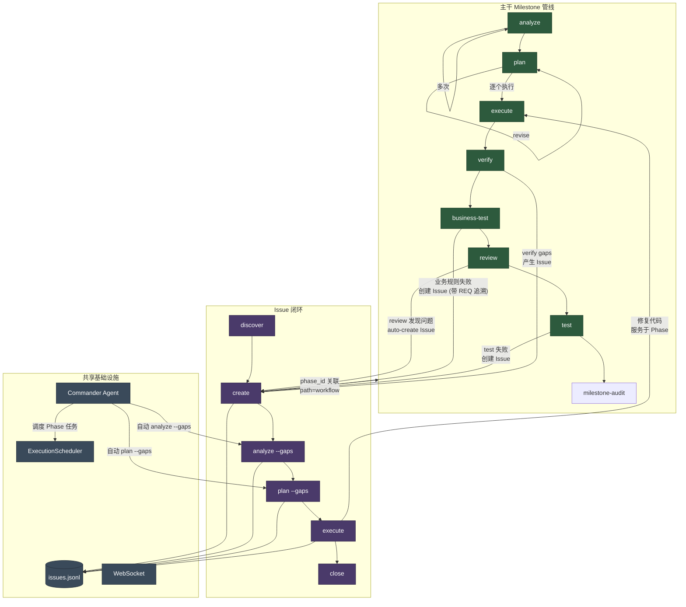
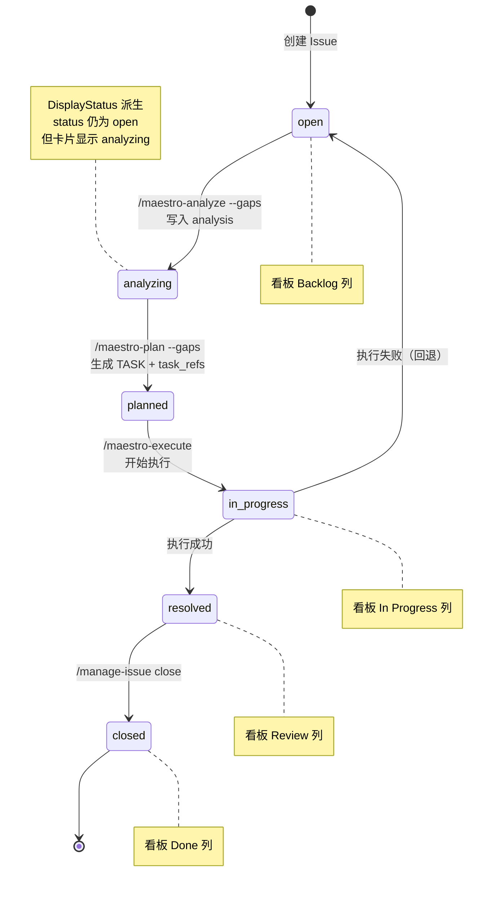

# Maestro 命令使用指南

Maestro 命令系统包含 49 个 slash 命令，分为 6 大类。本文档说明主干工作流的命令衔接、快速渠道、Issue 闭环工作流、学习工具集，以及各命令的使用场景。

## 命令总览

| 类别 | 命令数 | 前缀 | 职责 |
|------|--------|------|------|
| **核心工作流** | 16 | `maestro-*` | 项目初始化、规划、执行、验证、coordinate、milestones、overlays |
| **管理** | 12 | `manage-*` | Issue 生命周期、代码库文档、知识捕获、记忆管理、harvest、status |
| **质量** | 9 | `quality-*` | 代码审查、业务测试、UAT、调试、重构、复盘、同步 |
| **规范** | 3 | `spec-*` | 项目规范初始化、加载、录入 |
| **学习** | 5 | `learn-*` | 统一复盘（git+决策）、跟读学习、模式拆解、系统探究、多视角分析 |
| **知识图谱** | 2 | `wiki-*` | 连接发现、知识摘要 |

全局入口 `/maestro` 是智能协调器，根据用户意图和项目状态自动选择最优命令链。

### 命令全景图



### 主干与 Issue 的交互关系



> **核心关系说明**：Phase 管线和 Issue 闭环是两条并行的工作流，通过以下机制互联：
>
> 1. **Phase → Issue（问题产出）**：`quality-review` 审查代码时自动为 critical/high 级别发现创建 Issue；`quality-business-test` 业务测试失败时产生 Issue（带 REQ 追溯）；`quality-test` 失败时产生 Issue；`maestro-verify` 发现 gap 时可关联 Issue
> 2. **Issue → Phase（修复回注）**：Issue 通过 `phase_id` 字段关联到具体 Phase，`path=workflow` 标识该 Issue 属于 Phase 管线上下文；Issue 的 execute 修改的代码服务于所属 Phase
> 3. **Commander 双向驱动**：Commander Agent 同时管理 Phase 任务调度（通过 ExecutionScheduler）和 Issue 闭环推进（通过 AgentManager），形成统一的自动化调度层
> 4. **共享存储**：两条工作流共用 `issues.jsonl` 存储和 WebSocket 实时通信

### Issue 两种处理路径

Issue 的 `path` 字段区分两种处理路径：

| path | 含义 | 来源 | 生命周期 |
|------|------|------|----------|
| `standalone` | 独立 Issue，不绑定 Phase | 手动创建、`/manage-issue-discover`、外部导入 | 独立闭环，不影响 Phase 推进 |
| `workflow` | Phase 关联 Issue | `quality-review` auto-create、`quality-business-test` 失败产生、Phase 验证产生 | 可能阻塞 milestone 完成 |

- `standalone` Issue 在看板上独立显示，通过 Issue 闭环（analyze --gaps→plan --gaps→execute）自行解决
- `workflow` Issue 带有 `phase_id`，在看板中与对应 Phase 同列展示，其解决状态可能影响 milestone 是否可以 complete

```mermaid
graph LR
    subgraph standalone_path["standalone 路径"]
        S1["手动创建 /<br>discover 发现"] --> S2["独立闭环<br>analyze --gaps→plan --gaps→execute"]
        S2 --> S3["close"]
    end

    subgraph workflow_path["workflow 路径"]
        W1["review/verify/test<br>自动创建"] --> W2["关联 Milestone<br>milestone=M1"]
        W2 --> W3["Issue 闭环修复"]
        W3 --> W4["重新验证"]
        W4 --> W5["milestone-audit"]
    end

    style standalone_path fill:#1a1a2e,stroke:#4a4a6a
    style workflow_path fill:#1a2e1a,stroke:#4a6a4a
```



### Issue 闭环状态流转



### Milestone 工作流状态（基于 Artifact Registry）

```mermaid
stateDiagram-v2
    [*] --> no_artifacts: Milestone 开始
    no_artifacts --> analyzed: /maestro-analyze → ANL artifact
    analyzed --> analyzed: 再次 analyze（多次分析）
    analyzed --> planned: /maestro-plan → PLN artifact
    planned --> planned: plan revise / 碰撞检测通过
    planned --> executed: /maestro-execute → EXC artifact
    executed --> verified: /maestro-verify → VRF artifact
    verified --> audited: /maestro-milestone-audit
    audited --> completed: /maestro-milestone-complete
    completed --> [*]

    verified --> analyzed: gaps 发现 → re-analyze
    verified --> planned: gaps 发现 → plan --gaps
    executed --> planned: 失败 → debug → plan --gaps

    note right of analyzed: scratch/YYYYMMDD-analyze-PN-slug/<br/>可多次 analyze 不同 scope
    note right of planned: scratch/YYYYMMDD-plan-PN-slug/<br/>碰撞检测: 文件重叠预警
    note right of executed: .summaries/ 写入 plan dir<br/>逐个 plan 执行，plan 内 wave 并行
    note right of verified: verification.json 写入 plan dir
```

**核心设计**：Phase 是标签而非目录。所有工作产物存放在 `.workflow/scratch/`，通过 `state.json.artifacts[]` 注册追踪。每步产生一个 artifact 条目（ANL/PLN/EXC/VRF），形成依赖链。支持多次 analyze → 多次 plan（含碰撞检测）→ 逐个 execute（plan 间串行，plan 内 wave 并行）。

---

## 一、主干工作流（Phase Pipeline）

主干工作流以 **Phase**（阶段）为单位推进项目，每个 Phase 经历完整的生命周期管线。

### 1.1 项目初始化

```
/maestro-init → /maestro-roadmap 或 /maestro-spec-generate
```

| 步骤 | 命令 | 作用 | 产出 |
|------|------|------|------|
| 0 | `/maestro-brainstorm` (可选) | 多角色头脑风暴 | guidance-specification.md |
| 1 | `/maestro-init` | 初始化 .workflow/ 目录 | state.json, project.md, specs/ |
| 2a | `/maestro-roadmap` | 轻量路线图（交互式） | roadmap.md (phases 为标签) |
| 2b | `/maestro-spec-generate` | 完整规范链（7 阶段） | PRD + 架构文档 + roadmap.md |
| (可选) | `/maestro-ui-design` | UI 设计原型 | design-ref/ tokens |

**选择 2a 还是 2b**：小型项目或需求明确时用 roadmap；大型项目或需要完整规范文档时用 spec-generate。

### 1.2 Milestone 管线（Scratch-Based Artifact Registry）

```
/maestro-analyze → /maestro-plan → /maestro-execute → /maestro-verify → /quality-review → /maestro-milestone-audit → /maestro-milestone-complete
```

| 阶段 | 命令 | 输入 | 产出 | Artifact |
|------|------|------|------|----------|
| 分析 | `/maestro-analyze` | roadmap + project.md | context.md, analysis.md | ANL-{NNN} |
| 规划 | `/maestro-plan` | context.md (from ANL) | plan.json + TASK-*.json | PLN-{NNN} |
| 执行 | `/maestro-execute` | plan.json | .summaries/, 代码变更 | EXC-{NNN} |
| 验证 | `/maestro-verify` | .summaries/ | verification.json | VRF-{NNN} |
| 审查 | `/quality-review` | 代码变更 | review.json | REV-{NNN} |
| 调试 | `/quality-debug` | review findings / 用户反馈 | understanding.md | DBG-{NNN} |
| 测试 | `/quality-test` | verification criteria | uat.md | TST-{NNN} |
| 审计 | `/maestro-milestone-audit` | artifact registry | audit-report.md | — |
| 完成 | `/maestro-milestone-complete` | audit passed | 归档到 milestones/ | — |

**所有产出路径**: `scratch/YYYYMMDD-{type}[-P{N}|-M{N}]-{slug}/` — 日期前置便于排序，scope 前缀 P{N}/M{N} 作为 state.json 的备用标识。不再有 `.workflow/phases/` 目录。

**Scope 路由**: 无参数 = milestone 全量；数字 = 指定 phase；文本 = adhoc/standalone。

#### Scope 路由详解

每个管线命令（analyze/plan/execute/verify）支持 4 种 scope：

| 调用方式 | 前置条件 | scope | 说明 |
|---------|---------|-------|------|
| `analyze`（无参数） | init + roadmap | `milestone` | 覆盖当前里程碑所有 phases |
| `analyze 1` | init + roadmap | `phase` | 只处理 phase 1 |
| `analyze "topic"`（有 milestone） | 无 | `adhoc` | 分析任意主题，归属当前 milestone |
| `analyze "topic"`（无 milestone） | 无 | `standalone` | 分析任意主题，不归属 milestone |
| `plan --dir scratch/xxx` | 无 | 继承上游 scope | 直接指定 analyze 产物路径 |
| `execute --dir scratch/xxx` | 无 | 继承上游 scope | 直接执行指定 plan |

**Scope 判定**: 传文本参数时，若 `state.json.current_milestone` 非空 → `adhoc`，否则 → `standalone`。
无参数调用且无 roadmap → 报错，提示需要 topic 参数或先创建 roadmap。

#### 五种使用模式

**模式 A — 一步到位（milestone 全量）**

每步默认覆盖当前里程碑所有 phases，一个 plan 包含所有 phases 的 tasks。

```
analyze → plan → execute → verify
```

**模式 B — 逐 phase 分析/规划，逐个执行**

每个 plan 独立执行，不聚合。

```
analyze 1 → plan 1 → execute 1
analyze 2 → plan 2 → execute 2
verify
```

**模式 C — 混合模式**

```
analyze                  ← milestone 全量分析
plan 1 → execute 1       ← 先做 phase 1
plan 2 → execute 2       ← 再做 phase 2
analyze "hotfix" → plan --dir → execute --dir   ← 中途 ad-hoc
verify
```

**模式 D — 分析后统一规划执行**

```
analyze 1
analyze 2
plan                     ← milestone 全量规划（消费所有 analyze 产出）
execute                  ← 执行该 plan
```

**模式 E — 无 init / 无 roadmap（纯 scratch）**

不需要 init、不需要 roadmap，所有命令独立可用。state.json 自动按需创建。

```
analyze "implement auth"         ← scope=standalone
plan --dir scratch/analyze-xxx   ← 直接指定 analyze 产物
execute --dir scratch/plan-xxx   ← 直接执行
```

### 1.3 Gap 修复循环

当验证或测试发现缺口时：

```
/maestro-verify (发现 gaps) → /maestro-plan --gaps → /maestro-execute → /maestro-verify (重新检查)
/quality-business-test (业务规则失败) → /quality-debug --from-business-test → /maestro-plan --gaps → 重新执行
/quality-test --auto-fix (失败) → /quality-debug → /maestro-plan --gaps → 重新执行
```

### 1.4 里程碑管理

当一个里程碑的所有 Phase 都有完整 artifact 链（ANL→PLN→EXC）后：

```
/maestro-milestone-audit → /maestro-milestone-complete
```

- `milestone-audit`: 基于 artifact registry 检查 phase 覆盖度 + 跨 artifact 集成验证
- `milestone-complete`: 归档 scratch 目录到 `milestones/{M}/artifacts/`，artifact 条目移入 `milestone_history`，推进到下一里程碑
- 归档后运行 `/maestro continue` → 协调器检测 post-milestone 状态，自动加载 deferred items 并启动新分析

### 1.5 使用 Maestro 协调器

上述所有衔接可通过 `/maestro` 自动编排：

```bash
/maestro "实现用户认证模块"          # 意图识别 → 自动选择命令链
/maestro continue                    # 基于 state.json 自动执行下一步
/maestro -y "添加 OAuth 支持"        # 全自动模式（跳过所有交互确认）
/maestro --chain full-lifecycle      # 强制使用完整生命周期链
/maestro status                      # 快捷查看项目状态
```

**可用命令链**:

| 链名 | 命令序列 | 适用场景 |
|------|----------|----------|
| `full-lifecycle` | init→spec-generate→plan→execute→verify→review→test→milestone-audit | 全新项目 |
| `spec-driven` | init→spec-generate→... | 需要完整规范 |
| `roadmap-driven` | init→roadmap→... | 轻量路线图 |
| `brainstorm-driven` | brainstorm→init→roadmap→... | 从头脑风暴开始 |
| `ui-design-driven` | ui-design→plan→execute→verify | UI 设计驱动 |
| `analyze-plan-execute` | analyze→plan→execute | 快速分析-规划-执行 |
| `execute-verify` | execute→verify | 已有计划，直接执行 |
| `quality-loop` | review→test→debug | 质量流水线 |
| `milestone-close` | milestone-audit→milestone-complete | 关闭里程碑 |
| `next-milestone` | maestro-roadmap→plan→execute→verify | 启动下一里程碑（自动加载 deferred items） |
| `quick` | quick task | 即时小任务 |

---

## 二、快速渠道（Scratch Mode）

不走 Phase 管线，直接在 scratch 目录中完成任务。

### 2.1 快速任务

```bash
/maestro-quick "修复登录页面 bug"              # 最短路径，跳过可选 agent
/maestro-quick --full "重构 API 层"            # 带 plan-checker 验证
/maestro-quick --discuss "数据库迁移方案"       # 带决策提取（Locked/Free/Deferred）
```

产出存放在 `.workflow/scratch/{task-slug}/`，不影响主干 Phase。

### 2.2 快速分析 + 规划 + 执行

```bash
/maestro-analyze -q "性能优化"    # Quick 模式，仅决策提取 → 生成 context.md
/maestro-plan --dir .workflow/scratch/xxx   # 对 scratch 目录规划
/maestro-execute --dir .workflow/scratch/xxx  # 对 scratch 目录执行
```

`--dir` 参数跳过路线图验证，直接在指定目录工作。

### 2.3 Lite Plan 工作流（技能级别）

通过 Skill 系统的 `workflow-lite-plan` 实现更轻量的规划-执行链：

```bash
/workflow-lite-plan "实现 Issue 闭环系统"    # 探索→澄清→规划→确认→执行→测试审查
```

自动链接：`lite-plan → lite-execute → lite-test-review`，全程在 `.workflow/.lite-plan/` 下管理。

### 2.4 Standalone 模式（无需 init）

不需要 `maestro-init` 或 `maestro-roadmap`，直接运行命令即可。state.json 自动创建。

```bash
/maestro-analyze "实现 JWT 认证"              # scope=standalone，state.json 自动 bootstrap
/maestro-plan --dir scratch/20260420-analyze-jwt-...   # 对 analyze 产出规划
/maestro-execute --dir scratch/20260420-plan-jwt-...   # 直接执行
```

Standalone artifacts 不归属 milestone，不影响主干管线。

### 2.5 Scratch 清理

```bash
maestro scratch gc                # 清理 30 天前的 standalone scratch 目录
maestro scratch gc --days 7       # 清理 7 天前的
maestro scratch gc --dry-run      # 预览将清理的目录
```

**清理条件**: `scope=standalone` + `status=completed` + `harvested=true`（经验已提取）+ 超过指定天数。

---

## 三、Issue 闭环工作流

Issue 系统与 Phase 管线并行运行，既可独立闭环，也可与 Phase 深度联动。

**与主干的关系**（详见命令全景图中的"主干与 Issue 的交互关系"）：
- **Phase 产出 Issue**：`quality-review` 在审查时自动为 critical/high 发现创建 Issue（auto-issue creation）；`quality-business-test` 业务规则失败时创建 Issue（带 REQ 追溯）；`quality-test` 失败时创建 Issue；`maestro-verify` 的 gap 也可转化为 Issue
- **Issue 修复回注 Phase**：带 `phase_id` 的 Issue（`path=workflow`）执行修复后，代码变更服务于该 Phase，需重新 verify 和 test 才能通过 milestone-audit
- **独立 Issue 不阻塞 Phase**：`path=standalone` 的 Issue 通过 Issue 闭环自行解决，不影响 Phase 推进
- **Commander 统一调度**：Commander Agent 同时驱动 Phase 任务和 Issue 闭环，按 `execute > analyze > plan` 优先级自动调度

### 3.1 Issue 生命周期

```
发现 → 创建 → 分析 → 规划 → 执行 → 关闭
```

```
/manage-issue-discover                          # 自动发现问题
       ↓
/manage-issue create --title "..." --severity high   # 创建 Issue (open)
       ↓
/maestro-analyze --gaps ISS-xxx                 # 根因分析 → issue.analysis (diagnosed)
       ↓
/maestro-plan --gaps                            # 生成 TASK-*.json + issue.task_refs[] (planned)
       ↓
/maestro-execute                                # 执行 TASK → issue.status=resolved
       ↓
/manage-issue close ISS-xxx --resolution "fixed" # 关闭 Issue
```

### 3.2 各命令详解

#### `/manage-issue-discover` — 问题发现

两种模式：

```bash
/manage-issue-discover                        # 8 视角全扫描（安全/性能/可靠性/可维护/可扩展/UX/可访问/合规）
/manage-issue-discover by-prompt "检查 API 的错误处理" # 按提示词定向发现
```

产出：去重后的 Issue 列表，自动写入 `issues.jsonl`。

#### `/manage-issue` — CRUD 操作

```bash
/manage-issue create --title "内存泄漏" --severity high --source discovery
/manage-issue list --status open --severity high
/manage-issue status ISS-xxx
/manage-issue update ISS-xxx --priority urgent --tags "perf,memory"
/manage-issue close ISS-xxx --resolution "Fixed in commit abc123"
/manage-issue link ISS-xxx --task TASK-001      # 双向关联 Issue ↔ Task
```

#### `/maestro-analyze --gaps` — Issue 根因分析

```bash
/maestro-analyze --gaps ISS-xxx                 # 分析指定 Issue
/maestro-analyze --gaps ISS-xxx --tool qwen     # 指定工具
```

流程：读取 Issue → CLI 探索代码库 → 识别根因 → 写入 `issue.analysis` 字段（root_cause, impact, confidence, related_files, suggested_approach）。

分析完成后 Issue 状态变为 `diagnosed`。

#### `/maestro-plan --gaps` — Issue 方案规划

```bash
/maestro-plan --gaps                            # 基于 diagnosed Issue 生成 TASK
/maestro-plan --gaps ISS-xxx                    # 指定 Issue 规划
```

流程：读取 Issue + analysis → 生成 TASK-*.json → 写入 `issue.task_refs[]` 关联。复用主干 plan 的 TASK 结构，Issue 修复与 Phase 任务统一管理。

规划完成后 Issue 状态变为 `planned`。

#### `/maestro-execute` — Issue 方案执行

```bash
/maestro-execute                                # 执行 TASK（含 Issue 关联的 TASK）
/maestro-execute --dir scratch/xxx              # 指定 scratch 目录执行
```

流程：执行 Issue 关联的 TASK-*.json → TASK 完成后自动更新 `issue.status=resolved`。复用主干 execute 的调度机制，Issue 修复与 Phase 执行统一流程。

### 3.3 Issue 与看板集成

Issue 在 Dashboard 看板中的呈现方式：

| Issue Status | 看板列 | 显示状态 | 卡片特征 |
|-------------|--------|----------|----------|
| `open` (无 analysis) | Backlog | `open` (灰色) | 类型+优先级徽标 |
| `open` + analysis | Backlog | `analyzing` (蓝色) | + 分析标记 |
| `open` + solution | Backlog | `planned` (紫色) | + "N steps" 指示器 |
| `in_progress` | In Progress | `in_progress` (黄色) | + 执行状态动画 |
| `resolved` | Review | `resolved` (绿色) | 完成标记 |
| `closed` | Done | `closed` (灰色) | 归档 |

IssueCard 上的 **path 徽标** 标识 Issue 来源：
- `standalone` — 独立 Issue（手动创建或 discover 发现）
- `workflow` — Phase 关联 Issue（review/verify/test 自动创建，带 `phase_id`）

看板中可直接操作：
- **Analyze/Plan/Execute 按钮** → 在 Issue 详情弹窗中点击，通过 WebSocket 触发 maestro-analyze --gaps / maestro-plan --gaps / maestro-execute
- **执行器选择器** → 在 IssueCard 上 hover 显示，选择 Claude/Codex/Gemini
- **批量执行** → 多选 Issue 后使用 ExecutionToolbar

### 3.4 Commander Agent 自动化

Commander Agent 作为自主 supervisor 可自动推进 Issue 闭环，无需手动干预：

1. 发现 `open` 且无 `analysis` 的 Issue → 自动触发 `maestro-analyze --gaps`
2. 发现已 `diagnosed` 无 `task_refs` 的 Issue → 自动触发 `maestro-plan --gaps`
3. 按优先级排序执行：`execute > analyze > plan`

这意味着 Issue 可以在创建后由 Commander 全自动完成 analyze --gaps → plan --gaps → execute 的闭环。

---

## 四、质量管线

质量命令通常在 Phase 执行后运行，也可独立使用。

### 4.1 标准质量流程

```
/maestro-execute → /maestro-verify → /quality-business-test → /quality-review → /quality-test-gen → /quality-test → /maestro-milestone-audit
```

### 4.2 各命令说明

| 命令 | 用途 | 参数 | 典型场景 |
|------|------|------|----------|
| `/quality-business-test {N}` | PRD 正向业务测试 | `--spec` `--layer L1\|L2\|L3` `--gen-code` `--dry-run` `--re-run` `--auto` | 从 REQ 验收标准提取场景，L1接口→L2业务规则→L3场景渐进执行 |
| `/quality-review {N}` | 分层代码审查 | `--level quick\|standard\|deep` | 执行后审查代码质量 |
| `/quality-test-gen {N}` | 测试生成 | `--layer unit\|e2e\|all` | Nyquist 覆盖率分析 + RED-GREEN |
| `/quality-test {N}` | 会话式 UAT | `--smoke` `--auto-fix` | 验收测试 + 自动修复循环 |
| `/quality-debug` | 假设驱动调试 | `--from-uat {N}` `--from-business-test {N}` `--parallel` | 测试失败后根因分析 |
| `/quality-integration-test {N}` | 集成测试 | `--max-iter N` `--layer L0-L3` | L0-L3 渐进式集成测试 |
| `/quality-refactor` | 技术债务治理 | `[scope]` | 反思驱动的重构迭代 |
| `/quality-sync` | 文档同步 | `--since HEAD~N` | 代码变更后同步文档 |

### 4.3 测试三轨并行

三个测试命令从不同角度验证，互补而不替代：

| 命令 | 输入源 | 验证视角 |
|------|--------|----------|
| `/quality-business-test` | REQ-*.md 验收标准 | **PRD 正向** — 业务规则满足吗 |
| `/quality-test` | verification.json must_haves | **代码反向** — 代码能跑吗 |
| `/quality-test-gen` | validation.json gaps | **覆盖率反向** — 覆盖率够吗 |

### 4.4 调试闭环

```
/quality-business-test (业务规则失败) → /quality-debug --from-business-test {N} → 修复 → /quality-business-test --re-run (重新验证)
/quality-test (发现失败) → /quality-debug --from-uat {N} → 修复 → /quality-test (重新验证)
```

`quality-debug` 支持并行假设验证（`--parallel`），使用科学方法（假设→实验→验证）进行根因分析。

---

## 五、规范与知识管理

### 5.1 规范管理

```bash
/spec-setup                          # 扫描项目生成约定（已有项目自动触发，新项目可选）
/spec-add arch "使用 JSONL 格式存储 Issue"  # 录入设计决策
/spec-add coding "所有 API 端点使用 Hono 框架"  # 录入代码模式
/spec-load --category arch       # 加载规划相关规范（agent 执行前调用）
```

类型：`bug` / `pattern` / `decision` / `rule` / `debug` / `test` / `review` / `validation`

### 5.2 代码库文档

```bash
/manage-codebase-rebuild             # 全量重建 .workflow/codebase/ 文档
/manage-codebase-refresh             # 增量刷新（基于 git diff）
```

### 5.3 内存管理

```bash
/manage-knowhow-capture compact       # 压缩当前知识复用条目
/manage-learn tip "总是用 bun 而不是 npm" --tag tooling
/manage-knowhow list --store workflow --tag tooling
/manage-knowhow search "认证"
```

### 5.4 状态查看

```bash
/manage-status                       # 项目仪表板（进度、活跃任务、下一步建议）
```

---

## 六、命令衔接速查表

### 主干 Phase 管线

```mermaid
        graph LR
            INIT[init] --> RM["roadmap /<br>spec-generate"]
            RM -.-> UID["ui-design<br>(可选)"]
            RM --> AN[analyze]
            UID -.-> AN
            AN -->|"多次"| AN
            AN --> PL[plan]
            PL -->|"revise / 碰撞检测"| PL
            PL -->|"逐个执行"| EX[execute]
            EX --> VF[verify]
            VF --> QR[review]
            QR --> QT[test]
            QT --> MA[milestone-audit]
            VF -->|"gaps"| AN
            QT -->|"失败"| PL
        ```

### Issue 闭环

```mermaid
graph LR
    DIS[discover] --> CRE[create]
    CRE --> ANA["analyze --gaps"]
    ANA --> PLN["plan --gaps"]
    PLN --> EXE[execute]
    EXE --> CLS[close]

    CMD["Commander<br>Agent"]:::commander -->|自动| ANA
    CMD -->|自动| PLN
    CMD -->|自动| EXE

    classDef commander fill:#4a6fa5,color:#fff,stroke:#345
```

### 质量管线

```mermaid
        graph LR
            EX[execute] --> VF[verify]
            VF --> QR[review]
            QR --> TG[test-gen]
            TG --> QT[test]
            QT --> MA[milestone-audit]
            QT -->|"失败"| QD[debug]
            QD --> PL["plan --gaps"]
            PL --> EX2[execute]
            EX2 --> VF2[verify]
        ```

### 快速渠道

```mermaid
graph LR
    subgraph quick["快速任务"]
        MQ["/maestro-quick"]
    end

    subgraph scratch["Scratch 模式"]
        AQ["/maestro-analyze -q"] --> PD["/maestro-plan --dir"]
        PD --> ED["/maestro-execute --dir"]
    end

    subgraph lite["Lite 链"]
        LP["/workflow-lite-plan"] --> LE[lite-execute]
        LE --> LT[lite-test-review]
    end

    subgraph standalone["Standalone（无需 init）"]
        SA["analyze 'topic'"] --> SP["plan --dir"]
        SP --> SE["execute --dir"]
    end
```

---

## 七、常用工作流示例

### 新项目从零开始

```bash
/maestro-brainstorm "在线教育平台"
/maestro-init --from-brainstorm ANL-xxx
/maestro-roadmap "基于头脑风暴结果创建路线图" -y
/maestro-plan 1
/maestro-execute 1
/maestro-verify 1
/maestro-milestone-audit
/maestro-milestone-complete
```

### 一键全自动

```bash
/maestro -y "实现用户认证系统"
# 自动执行: init → roadmap → plan → execute → verify → review → test → milestone-audit
```

### 发现并修复问题

```bash
/manage-issue-discover by-prompt "检查所有 API 端点的错误处理"
/maestro-analyze --gaps ISS-xxx
/maestro-plan --gaps
/maestro-execute
/manage-issue close ISS-xxx --resolution "已修复"
```

### 快速修复一个 bug

```bash
/maestro-quick "修复登录页面在移动端的样式错乱"
```

### 阶段执行后发现测试失败

```bash
/quality-business-test 3             # PRD 正向业务测试（L1→L2→L3）
/quality-test 3                     # 会话式 UAT
# 如果发现失败：
/quality-debug --from-business-test 3  # 从业务测试失败诊断根因
/maestro-plan 3 --gaps              # 生成修复计划
/maestro-execute 3                  # 执行修复
/quality-business-test 3 --re-run   # 只重跑失败场景
/maestro-milestone-audit            # 审计里程碑
```

---

## Wiki 知识图谱系统

Wiki 系统是 Maestro 的知识索引核心，把 `.workflow/` 下的 markdown 文件和 JSONL 行统一抽象为 `WikiEntry` 节点，支持 BM25 搜索、图谱分析和持久化索引。

### 节点类型

| 类型 | 来源 | 写入权限 | 说明 |
|------|------|---------|------|
| `project` | `project.md` | 只读 | 项目描述 |
| `roadmap` | `roadmap.md` | 只读 | 路线图 |
| `spec` | `specs/<slug>.md` | 可写 | 规范文档 |
| `knowhow` | `knowhow/KNW-<slug>.md` | 可写 | 知识复用条目（由 `/manage-knowhow-capture` 创建） |
| `note` | `memory/TIP-<slug>.md` | 可写 | 快速笔记 |
| `issue` | `issues/*.jsonl` 行 | 只读（虚拟） | 问题追踪 |
| `lesson` | `learning/*.jsonl` 行 | 只读（虚拟） | 学习洞察 |

### 条目字段

每个 WikiEntry 除基础字段（id, title, tags, status, related）外，还支持 4 个溯源字段：

| 字段 | 用途 | 示例 |
|------|------|------|
| `category` | 内容分类 | `security`, `debug`, `learning`, `arch` |
| `createdBy` | 创建该条目的命令 | `memory-capture`, `manage-harvest`, `manual` |
| `sourceRef` | 来源锚点 | `WFS-auth-001`, `HRV-a1b2c3d4`, `commit:abc123` |
| `parent` | 父条目 ID（层级关系） | `spec-auth-patterns` |

### CLI 命令

```bash
# 列表 + 过滤
maestro wiki list                                    # 全部条目
maestro wiki list --type spec                        # 按类型
maestro wiki list --category security                # 按分类
maestro wiki list --created-by manage-harvest        # 按创建来源
maestro wiki list --tag auth --status active          # 组合过滤
maestro wiki list --group                            # 按类型分组

# 搜索（BM25 全文）
maestro wiki search "authentication token"

# 创建（spec/memory/note）
maestro wiki create --type spec --slug auth-patterns \
  --title "Auth Patterns" --body "# Auth\n..." \
  --category security --created-by manual \
  --source-ref "session-001" --parent "spec-coding-conventions" \
  --frontmatter '{"tags":["auth"]}'

# 创建 memory（模拟 memory-capture）
maestro wiki create --type memory --slug session-2026-04-25 \
  --title "Debug Session" --body "..." \
  --created-by memory-capture --source-ref "WFS-debug-001"

# Spec 条目级操作（统一写入路径）
maestro wiki append spec-learnings --category bug --body "Cache invalidation issue"
maestro wiki append spec-coding-conventions --category coding \
  --body "Use named exports for utility functions" --keywords "exports,module"
maestro wiki remove-entry spec-learnings-003         # 按 ID 精确移除子条目

# 更新 / 删除
maestro wiki update spec-auth-patterns --title "New Title"  # frontmatter only
maestro wiki delete spec-auth-patterns

# 图谱分析
maestro wiki health                                  # 健康评分
maestro wiki orphans                                 # 孤立节点
maestro wiki hubs --limit 10                         # 中心节点
maestro wiki backlinks spec-auth                     # 谁引用了它
maestro wiki forward spec-auth                       # 它引用了谁
maestro wiki graph                                   # 完整图谱 JSON
```

### 持久化索引

每次 create/update/delete 后，系统自动生成 `.workflow/wiki-index.json`（轻量版，不含 body）：

```json
{
  "version": 2,
  "generatedAt": 1777096303681,
  "entries": [
    {
      "id": "spec-auth-patterns",
      "type": "spec",
      "title": "Auth Patterns",
      "category": "security",
      "createdBy": "manual",
      "sourceRef": "session-001",
      "parent": null,
      "tags": ["auth"],
      "status": "active",
      "related": [],
      "source": { "kind": "file", "path": "specs/auth-patterns.md" }
    }
  ]
}
```

### Spec 原子节点索引

WikiIndexer 扫描 `specs/*.md` 时，每个 `<spec-entry>` 块被解析为独立的 WikiEntry 子节点（如 `spec-learnings-001`），通过 `parent` 指向容器节点（如 `spec-learnings`）。这意味着：

- **BM25 搜索**可定位到具体条目（而非整个文件）
- **图谱分析**的粒度为条目级（子节点可被链接、分析）
- **keywords 上浮**：子节点的 keywords 自动合并到容器的 frontmatter，使 `--tag` 过滤可达

### Spec 写保护

`wiki update` 对 `specs/*.md` 文件的 body 更新返回 403（FORBIDDEN）。条目级操作使用：

- `maestro wiki append <containerId>` — 追加 `<spec-entry>` 块
- `maestro wiki remove-entry <entryId>` — 精确移除子条目

### 图谱连接

条目之间通过三种机制建立连接：

- **`related` frontmatter** — 显式声明的双向关联：`related: ["[[spec-auth]]"]`
- **`[[wikilink]]`** — body 中的内联引用，自动解析为 forward link
- **`parent`** — 层级关系，自动计入 child → parent 的 forward link

健康评分公式：`score = max(0, 100 − 2×brokenLinks − 1×orphans − 3×missingTitles)`

---

## 学习工具集 (learn-* / wiki-*)

基于 Wiki 知识图谱和 Spec 系统构建的主动学习引擎。吸收了 [gstack](https://github.com/AgeofIA/gstack) 的 `/retro`、`/codex`、`/investigate` 等优势，并充分利用 Maestro 独有的 Wiki 知识图谱（BM25 搜索、反向链接、健康评分）。

所有学习命令共享 `.workflow/learning/lessons.jsonl` 作为洞察汇聚点，通过 `source` 字段区分来源，与 `/manage-learn` 和 `/quality-retrospective` 完全兼容。

### 知识流向

```
learn-retro (git+decision) ─┐
learn-follow ───────────────┼─> lessons.jsonl ───┬─> specs (via /spec-add)
learn-decompose ────────────┤                    ├─> wiki (via maestro wiki create)
learn-second-opinion ───────┤                    └─> issues (via /manage-issue)
learn-investigate ──────────┘
                                 wiki-connect ──> wiki 图谱质量提升
                                 wiki-digest  ──> 知识摘要 + gap→issue 路由
```

### learn-* 命令

#### `/learn-retro` — 统一复盘（Git + 决策）

统一复盘命令，通过 `--lens` 切换 Git 活动分析和决策质量评估。不依赖工作流 Phase 状态。

**Git lens**：计算提交指标、检测工作会话、分析测试比率、追踪趋势。
**Decision lens**：从 Wiki/Specs/Git 多源收集架构决策，3 视角并行评估，分类为 Validated / Aging / Questionable / Stale / Reversed。

```bash
/learn-retro                            # 默认 --lens all（两个视角）
/learn-retro --lens git                 # 仅 Git 活动复盘
/learn-retro --lens decision            # 仅决策评估
/learn-retro --lens git --days 14       # Git: 最近 14 天
/learn-retro --lens git --author alice  # Git: 按作者过滤
/learn-retro --lens git --area src/auth # Git: 按目录范围
/learn-retro --lens git --compare       # Git: 对比上次复盘趋势
/learn-retro --lens decision --phase 2  # Decision: Phase 2 的决策
/learn-retro --lens decision --tag auth # Decision: 按标签过滤
```

**输出**：`.workflow/learning/retro-{date}.md` + `.json`，洞察追加到 `lessons.jsonl`（source: `retro-git` / `retro-decision`）。

#### `/learn-follow` — 跟读学习

引导式代码/Wiki 阅读，逐段施加 4 个强制提问（什么模式？为何不用替代方案？依赖什么假设？改了会坏什么？），提取模式并构建理解图。

```bash
/learn-follow src/commands/wiki.ts      # 跟读代码文件
/learn-follow spec-auth                 # 跟读 Wiki 条目
/learn-follow "authentication flow"     # 按主题搜索
/learn-follow src/mcp/ --depth deep     # 深度跟读目录
/learn-follow spec-auth --save-wiki     # 保存为 Wiki 笔记
```

#### `/learn-decompose` — 代码模式拆解

4 维度并行分析（结构/行为/数据/错误模式），产出模式目录，可入库到 Specs 和 Wiki。

```bash
/learn-decompose src/commands/          # 分析目录
/learn-decompose src/mcp/ --save-spec   # 新模式写入 specs
/learn-decompose src/core/ --save-wiki  # 新模式创建 wiki 笔记
/learn-decompose src/hooks/ --patterns observer,middleware  # 只找指定模式
```

#### `/learn-second-opinion` — 多视角分析

三种模式：review（3 人格并行评审）、challenge（对抗式分析）、consult（交互问答）。

```bash
/learn-second-opinion src/mcp/server.ts           # 默认 review 模式
/learn-second-opinion HEAD --mode challenge        # 对抗式审查 git diff
/learn-second-opinion spec-auth --mode consult     # 交互式问答
/learn-second-opinion 3                            # 审查 Phase 3 的 plan
```

#### `/learn-investigate` — 系统化探究

带假说测试、证据日志、3-strike 升级的系统化探究流程。用于理解性问题，不同于 `quality-debug` 的 bug 修复。

```bash
/learn-investigate "wiki 的 BM25 搜索如何工作"
/learn-investigate "delegate channel 的并发控制" --scope src/mcp/
/learn-investigate "hook 系统如何注入 specs"
```

### wiki-* 命令

#### `/wiki-connect` — 知识图谱连接发现

分析 Wiki 索引，找出孤立节点、缺失连接、传递性链接缺口，建议或自动应用新的 `related` 链接。

```bash
/wiki-connect                           # 分析全图谱
/wiki-connect --scope spec              # 只分析 spec 类型
/wiki-connect --fix                     # 自动应用建议的连接
/wiki-connect --min-similarity 0.5      # 提高相似度阈值
```

#### `/wiki-digest` — 知识摘要生成

从 Wiki 知识图谱生成主题聚类的知识摘要，包含覆盖热图和缺口分析。

```bash
/wiki-digest                            # 全图谱摘要
/wiki-digest "authentication"           # 按主题摘要
/wiki-digest --recent 7                 # 最近 7 天更新的条目
/wiki-digest --type spec --format full  # 详细 spec 摘要
```

### 学习场景示例

#### 接手新项目，快速理解代码

```bash
/learn-follow src/                       # 从入口跟读
/learn-decompose src/ --save-spec        # 拆解模式，入库到 specs
/wiki-digest                             # 生成知识摘要
/wiki-connect --fix                      # 修复图谱连接
```

#### 周末复盘

```bash
/learn-retro --lens git                  # Git 活动复盘
/learn-retro --lens decision             # 决策复盘
/manage-learn list --tag git-retro       # 浏览复盘洞察
```

#### 深入理解某个模块

```bash
/learn-follow src/mcp/ --depth deep      # 深度跟读
/learn-second-opinion src/mcp/ --mode challenge  # 对抗式审查
/learn-investigate "MCP delegate 如何处理超时"     # 系统探究
```
